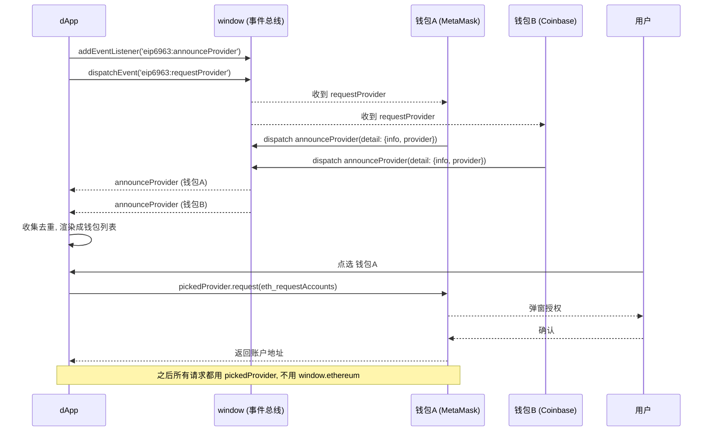

# 09 · 多钱包发现（EIP-6963 Multi Injected Provider Discovery）

> 当浏览器装了多个钱包插件时，它们会互相抢占 `window.ethereum`。EIP-6963 改用事件机制让每个钱包各自广播自己，dApp 把所有钱包列出来让用户选。

## 📖 知识讲解

**旧世界的问题：单点 `window.ethereum` 抢占。**
早期所有钱包都把自己的 provider 注入到同一个全局变量 `window.ethereum`。用户只装一个钱包时没问题，但一旦装了多个（MetaMask + Coinbase Wallet + OKX + Rabby…），它们会互相覆盖：

- 谁后注入谁赢，`window.ethereum` 到底指向哪个钱包变得**不确定**；
- 用户想用 A 钱包，结果 dApp 连上了 B；
- 有的插件甚至会激进地劫持这个变量，体验混乱。

**EIP-6963 的解法：基于事件的去中心化发现。**
不再抢一个全局变量，而是约定两个事件字符串：

- `eip6963:announceProvider`：**钱包广播**自己，`event.detail` 里带上钱包信息和 provider 实例；
- `eip6963:requestProvider`：**dApp 请求**，催促所有钱包重新广播一次。

握手流程是：dApp 先 `addEventListener('eip6963:announceProvider', ...)` 挂好监听，再 `dispatchEvent(new Event('eip6963:requestProvider'))`。每个钱包收到 request 后各自 announce 一次，dApp 就把它们全部收集起来，渲染成一个「选择钱包」列表，用户点哪个就用哪个的 provider。

**`event.detail` 结构：**

```js
{
  info: {
    uuid,        // 每次会话随机的实例 id
    name,        // 展示名，如 "MetaMask"
    icon,        // dataURI 图标，可直接作 img src
    rdns         // 反向域名，稳定标识，如 "io.metamask"
  },
  provider       // 该钱包的 EIP-1193 provider 实例
}
```

**关键点：拿到用户选择的钱包后，用 `pickedProvider.request(...)` 发所有后续请求，而不是 `window.ethereum`。** 这样才能确保连的是用户真正选的那个钱包。`info.rdns`（如 `io.metamask`、`com.coinbase.wallet`）相对稳定，可用来识别/记住用户的选择。

## 🔄 流程图 / 原理图



## 💻 代码说明

- **先挂监听再请求**：页面一加载就 `addEventListener('eip6963:announceProvider')`，再 `dispatch('eip6963:requestProvider')`，顺序反了会漏掉应答。
- **用 `Map` 按 `rdns` 去重**：同一钱包可能广播多次，用 `rdns` 作 key 收集。
- **`info.icon` 是 dataURI**：直接塞进 `` 即可显示钱包图标。
- **`connectWith(info, provider)`**：点某个钱包按钮时，用**它自己的** `provider.request({ method:'eth_requestAccounts' })` 连接，并记录 `rdns`。
- **错误处理**：捕获 `error.code === 4001`（用户拒绝）。

## ▶️ 运行方式

1. 浏览器安装支持 EIP-6963 的钱包（新版 MetaMask 已支持；装两个钱包效果更明显）。
2. 用浏览器直接打开本目录的 `index.html`。
3. 页面加载即自动发现；也可点「发现钱包」再广播一次。
4. 在列出的钱包按钮里点选一个 → 在弹窗授权 → 查看连接到的账户和所选钱包的 `rdns`。

## ⚠️ 常见坑 / 安全提示

- **别硬编码 `window.ethereum`**：多钱包环境下它可能被覆盖成别的钱包。用 EIP-6963 让用户明确选择。
- **钓鱼钱包可伪造 `name`/`icon`**：图标和名字都是钱包自己提供的，恶意插件可以冒充知名钱包。`rdns` 相对稳定但**也非绝对可信**，最终仍需用户对自己安装的插件负责。
- **先监听后请求**：`dispatch requestProvider` 前必须先挂好 `announceProvider` 监听，否则收不到应答。
- **列表可能为空**：老钱包或未启用 EIP-6963 时不会广播，属正常现象，此时可回退到旧的 `window.ethereum`（但要提示用户风险）。

## 🔗 官方文档

- EIP-6963 规范：https://eips.ethereum.org/EIPS/eip-6963
- MetaMask 关于 EIP-6963 的指南：https://docs.metamask.io/wallet/concepts/wallet-interoperability/
- MetaMask Provider API：https://docs.metamask.io/wallet/reference/provider-api/
- EIP-1193（Provider 规范）：https://eips.ethereum.org/EIPS/eip-1193
