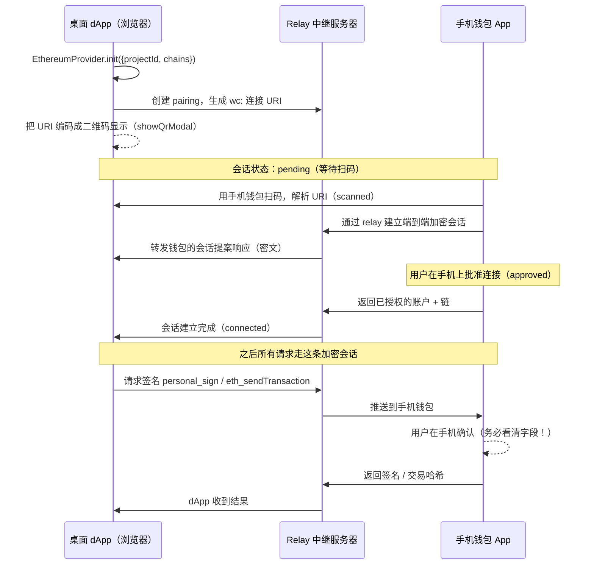
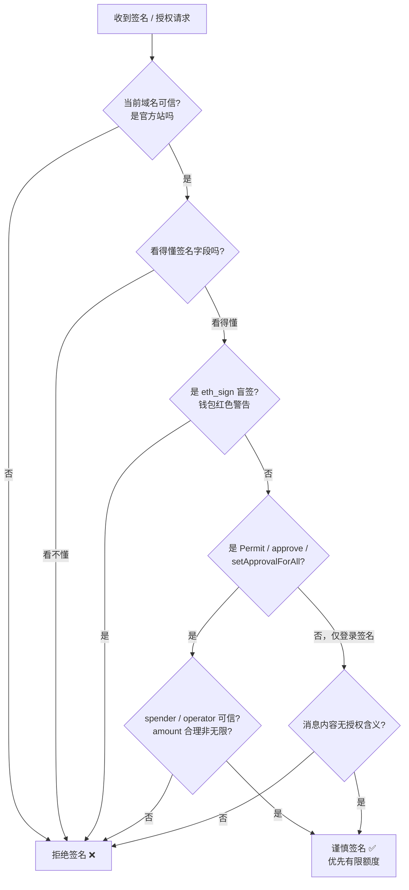

# 10 · WalletConnect 与签名安全（WalletConnect & Signature Security）
> 用二维码让手机钱包给桌面 dApp 签名，同时把整套「钱包集成」里最致命的**签名钓鱼与无限授权**风险讲透 —— 这是本工程的安全总结章。

## 📖 知识讲解

### 一、WalletConnect 是什么

前面 9 个模块用的都是**注入式（injected）** provider：钱包插件往网页里塞一个 `window.ethereum`，dApp 和钱包在**同一台设备、同一个浏览器**里对话。

但很多人的资产在**手机钱包**里（MetaMask App、imToken、OKX Wallet、Rainbow…），电脑浏览器里并没有装插件。**WalletConnect** 就是为「桌面 dApp ↔ 手机钱包」这种**跨设备**场景设计的。

关键认知：

- **WalletConnect 不是一个浏览器插件，而是一套开放协议**。它通过**二维码**（桌面扫手机）或 **deep link**（手机内点击唤起钱包），在 dApp 与钱包之间建立一条**端到端加密的点对点会话**，中间靠一台 **relay（中继服务器）** 转发密文消息（relay 只转发密文，看不到内容）。
- 建立会话后，dApp 不需要注入 provider，就能把「请签名 / 请发交易」的请求推送到手机上，用户在**手机钱包里确认**，签名结果再经 relay 回传给 dApp。
- 它现在由 **Reown**（前身即 WalletConnect Inc.）维护，当前主推 **WalletConnect v2 协议 / Reown AppKit（前身 Web3Modal）**。老的 v1 已停用，不要再学 v1。

### 二、和注入式（EIP-1193 / EIP-6963）对比

| 维度 | 注入式（模块 01–09） | WalletConnect（本模块） |
|---|---|---|
| 形态 | 浏览器插件注入 `window.ethereum` | 开放协议 + 二维码 / deep link |
| 设备 | 同设备、同浏览器 | **跨设备**：桌面 dApp + 手机钱包 |
| 传输 | 进程内直接调用 | 加密 P2P 会话，经 relay 中继 |
| 需要什么 | 用户装了插件即可 | dApp 需申请 **projectId** + 联网 relay |
| 对上层 API | EIP-1193 `request/on` | **同样是 EIP-1193** `request/on` |

**最重要的一点**：WalletConnect 拿到会话后，对你 JS 代码暴露的**仍然是一个符合 EIP-1193 的 provider**。也就是说前 9 个模块学的 `provider.request({ method, params })`、`eth_requestAccounts`、`personal_sign`、`eth_sendTransaction`、`chainChanged` 事件…… **全部通用**，你只是把「provider 从哪来」换了个来源而已。

### 三、现代集成方式（真实 API）

拿到 provider 一般有两条主流路径，都需要先去 **https://cloud.reown.com** 免费申请一个 `projectId`：

1. **`@walletconnect/ethereum-provider`（底层、最直接）**
   ```js
   import { EthereumProvider } from '@walletconnect/ethereum-provider'

   const provider = await EthereumProvider.init({
     projectId: 'YOUR_PROJECT_ID',   // 来自 cloud.reown.com
     chains: [11155111],             // Sepolia 测试网（本系列只用测试网）
     showQrModal: true               // 自动弹出内置二维码弹窗
   })

   await provider.connect()          // 弹二维码，等手机钱包扫码批准
   // 之后就是熟悉的 EIP-1193：
   const accounts = await provider.request({ method: 'eth_accounts' })
   ```

2. **Reown AppKit（前 Web3Modal，上层、带 UI）**：封装了钱包列表、二维码弹窗、多链切换等完整 UI，`createAppKit({ projectId, networks, ... })` 一把梭，适合正式项目。也提供 CDN 引入方式。

> ⚠️ 因为 WalletConnect 依赖 `projectId` 和联网 relay，npm 依赖也较重，**本模块的 `index.html` 以「讲解 + 可视化流程模拟」为主**：页面里用一个**纯前端状态机**模拟扫码会话的建立过程（`pending → scanned → approved → connected`），并把上面这段**真实最小接入代码**原样展示出来，但不强制你真的联网。想真跑，就用 Vite/Next 项目 `npm i @walletconnect/ethereum-provider` 按上面代码接入。

### 四、签名安全 / 钓鱼防范（本工程安全总结）

签名是 Web3 里**最危险**的动作：一次误签，可能不产生任何「转账」交易，却让攻击者在事后合法地把你的代币全部取走。务必看懂下面每一种攻击面。

**常见攻击面：**

1. **钓鱼 `personal_sign`**：诱导你签一段「看起来人畜无害」的文字，实则是某个登录凭证 / 授权口令。看不懂的消息**一律不签**。
2. **`eth_signTypedData_v4` 的 Permit（[ERC-2612](https://eips.ethereum.org/EIPS/eip-2612)）/ Permit2 授权签名** ⭐ 最阴险：这是一个**链下签名**，不产生链上交易、钱包里看不到「pending 交易」，但它等价于给某个 `spender` 授权花费你的代币。攻击者拿到这个签名后，随时可以自己发一笔交易把你的币划走。很多「零成本 gas 领空投」骗局就是骗这个签名。
3. **`approve` / `setApprovalForAll` 无限授权**：ERC-20 的 `approve(spender, amount)` 若把 `amount` 设成 `uint256` 最大值（无限额度），或 ERC-721 的 `setApprovalForAll(operator, true)` 全量授权，一旦 `spender/operator` 是恶意合约，你的资产就长期敞口。
4. **已废弃的 `eth_sign`（盲签）**：它让你对**任意 32 字节哈希**签名，你完全不知道自己签的是什么（可能就是一笔转账交易的哈希）。正经钱包会对它弹**红色警告**，**任何情况下都不要签**。
5. **假 dApp / 假弹窗 / address poisoning / 篡改 to·value**：钓鱼站仿冒真站域名；转账历史里投毒一个长得极像你常用地址的「相似地址」诱导你复制粘贴错；或在交易里偷偷改掉 `to` / `value`。

**防范清单（务必内化成肌肉记忆）：**

- ✅ **核对域名**：签名 / 授权前先确认浏览器地址栏域名和合约地址是官方的（收藏夹进入，别点搜索广告）。
- ✅ **看懂每一个字段**：`spender` 是谁？`amount` 多少？`token` 是哪个？看不懂就拒绝。
- ✅ **优先有限额度授权**，别点「无限 / Max」；用完记得去 **https://revoke.cash** 撤销旧授权，定期体检。
- ✅ **EIP-712（`signTypedData_v4`）结构化签名优于盲签**：至少字段是人类可读的；坚决拒绝 `eth_sign` 盲签。
- ✅ **大额用硬件钱包**（Ledger / Trezor），把私钥隔离在设备里。
- ✅ **只在测试网练习**：本系列全程 **Sepolia（chainId `0xaa36a7` = 11155111）**，永远不要拿主网资产练手。
- ✅ **认准钱包的安全红条**：MetaMask/Rabby 等对高风险签名会显示红色/橙色警告，看到就停下来。

## 🔄 流程图 / 原理图

### 图 1：WalletConnect 扫码连接握手（sequenceDiagram）



### 图 2：签名前安全决策树（flowchart）



## 💻 代码说明

`index.html` 是**纯前端、不联网**的教学页，包含三块：

1. **WalletConnect 会话模拟面板**：点「生成二维码」用 CSS 画一个假二维码，会话进入 `pending`；再依次点「手机扫码」「钱包批准」「会话建立」，按钮驱动一个状态机在 `pending → scanned → approved → connected` 之间流转，顶部四个步骤点高亮当前状态，`log` 区打印每一步。这只是**把上面 sequenceDiagram 可视化**，帮助理解握手时序，**不产生任何真实连接**。
2. **真实最小接入代码展示**：页面里用 `<pre>` 原样贴出 `EthereumProvider.init(...)` + `provider.connect()` + `provider.request(...)` 的真实代码，方便你复制到真正的项目里用。
3. **签名安全自查清单（交互勾选）**：把上面的「防范清单」做成可勾选项，全部勾选后才点亮「我已理解风险」。配合 `.danger` / `.warn` 高亮框强调 Permit 链下授权、无限 approve、`eth_sign` 盲签这几个最致命的坑。

关键函数：`genQr()` 生成二维码并置为 `pending`；`advance(next)` 推进状态机并更新步骤高亮；`checkList()` 统计勾选进度。全部逻辑都有中文注释。

## ▶️ 运行方式

1. 直接用浏览器打开本目录的 `index.html`（`file://` 即可，**无需起服务器、无需联网**）。
2. 在「会话模拟」面板按顺序点击按钮，观察状态从 `pending` 走到 `connected` 的完整时序。
3. 阅读页面里贴出的真实 `@walletconnect/ethereum-provider` 代码片段。
4. 完成「签名安全自查清单」的勾选，确保每一条都真正理解。

**想体验真实 WalletConnect（进阶，可选）：**

```bash
npm create vite@latest wc-demo -- --template vanilla
cd wc-demo && npm i @walletconnect/ethereum-provider
# 去 https://cloud.reown.com 申请 projectId 填入代码，chains 用 [11155111]（Sepolia）
npm run dev
# 桌面页面弹出二维码，用手机 MetaMask 切到 Sepolia 后扫码
```

## ⚠️ 常见坑 / 安全提示

- **Permit / Permit2 链下授权是最容易忽视的资产杀手**：它**不产生链上交易**，钱包活动记录里看不到，却等于把花你代币的权限签给了别人。凡是「免 gas 领取 / 一键授权」的签名，务必逐字段核对 `spender` 和 `value`，看不懂就拒绝。
- **`eth_sign` 盲签永远不要签**：它签的是任意 32 字节哈希，你无法得知内容，钱包会红色警告。正经 dApp 不会用它。
- **无限授权（`uint256` max / `setApprovalForAll`）要慎点**：优先有限额度；定期上 **https://revoke.cash** 撤销不再需要的授权。
- **WalletConnect 必须有 `projectId` 和联网 relay**：纯 `file://` 静态页跑不起真实会话，这也是本模块用「模拟」演示的原因。别把 `projectId` 当私钥——它是公开的客户端标识，但也别乱贴。
- **别学 WalletConnect v1**：v1 已停服，只用 v2 / Reown AppKit。网上老教程很多是 v1，注意甄别时效。
- **核对域名 + 收藏夹进站**：搜索引擎广告位常有钓鱼仿站，`revoke.cash` / `app.uniswap.org` 等都请从收藏夹进入。
- **本系列全程只用 Sepolia 测试网**（chainId `0xaa36a7` = 11155111），大额资产请用硬件钱包，永远不要拿主网练手。

## 🔗 官方文档

- WalletConnect / Reown 文档（旧域名）：https://docs.walletconnect.com/
- Reown 文档（AppKit / EthereumProvider，当前主站）：https://docs.reown.com/
- Reown Cloud（申请 projectId）：https://cloud.reown.com
- MetaMask 签名数据（`personal_sign` / `signTypedData`）指南：https://docs.metamask.io/wallet/how-to/sign-data/
- ERC-2612（Permit 链下授权）：https://eips.ethereum.org/EIPS/eip-2612
- EIP-1193（Provider JavaScript API，WalletConnect 同样遵循）：https://eips.ethereum.org/EIPS/eip-1193
- revoke.cash（查看 / 撤销代币授权）：https://revoke.cash
