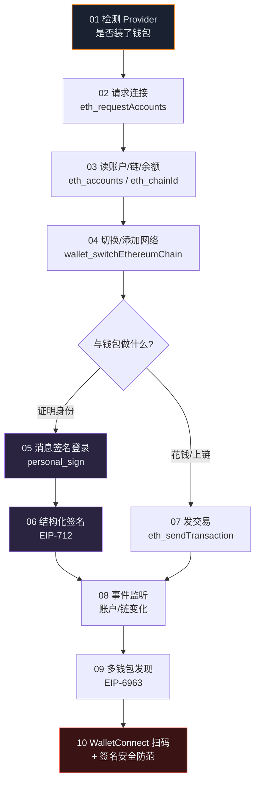

# 09 · 钱包集成（Wallet Integration · MetaMask / EIP-1193）

> 学习 dApp 前端如何与浏览器钱包（MetaMask 等）对话：从检测钱包、请求连接、读账户/链、切换网络，到签名登录、结构化签名、发交易、事件监听、多钱包发现，最后到 WalletConnect 扫码连接与签名安全防范。全部基于 **EIP-1193** 标准 Provider 接口，原生 JS 直接用 `window.ethereum`，浏览器 + MetaMask 打开即可交互。

## 📖 本工程讲什么

浏览器钱包会向网页注入一个符合 **EIP-1193** 的 Provider 对象（历史上是 `window.ethereum`，现代用 **EIP-6963** 多钱包发现）。dApp 前端通过一个统一入口与钱包通信：

```js
// 所有钱包交互都收敛到这一个方法
const result = await window.ethereum.request({ method, params });
// 以及事件订阅
window.ethereum.on('accountsChanged', handler);
```

掌握这套「请求 + 事件」模型，就能不依赖任何库、用纯 JS 完成一个完整 dApp 的钱包层。ethers.js / viem / wagmi（本合集 08、10 工程）都是在这层之上的封装。

## 🗂️ 模块索引

| 模块 | 知识点 | 核心 RPC / 标准 | 配图 |
| --- | --- | --- | --- |
| [01-detect-provider](./01-detect-provider/) | 检测 Provider / 是否装了钱包 | `window.ethereum`、`isMetaMask`、EIP-1193 | flowchart 检测决策 |
| [02-connect-accounts](./02-connect-accounts/) | 请求授权连接账户 | `eth_requestAccounts`、`wallet_requestPermissions` | **握手时序图** |
| [03-read-account-chain](./03-read-account-chain/) | 读账户 / 链 / 余额 | `eth_accounts`、`eth_chainId`、`eth_getBalance` | 只读查询流程 |
| [04-switch-add-network](./04-switch-add-network/) | 切换 / 添加网络 | `wallet_switchEthereumChain`、`wallet_addEthereumChain`、错误 4902 | flowchart 决策 |
| [05-sign-message](./05-sign-message/) | 消息签名登录 | `personal_sign`（SIWE 思路） | **签名时序图** |
| [06-sign-typed-data](./06-sign-typed-data/) | EIP-712 结构化签名 | `eth_signTypedData_v4` | **EIP-712 时序图** |
| [07-send-transaction](./07-send-transaction/) | 通过钱包发交易 | `eth_sendTransaction` | 发交易时序图 |
| [08-provider-events](./08-provider-events/) | Provider 事件监听 | `accountsChanged`、`chainChanged`、`connect`、`disconnect` | 状态图 |
| [09-eip-6963](./09-eip-6963/) | 多钱包发现（解决插件冲突） | `eip6963:announceProvider` / `requestProvider` | 发现握手时序图 |
| [10-walletconnect-and-security](./10-walletconnect-and-security/) | WalletConnect 扫码 + 签名安全 | WalletConnect v2 / Reown、钓鱼防范 | 扫码时序图 + 安全决策树 |

## 🧭 学习路线



建议顺序：**先连接（01→04）→ 再交互（05→07）→ 再健壮性与生态（08→10）**。签名相关（05、06）与发交易（07）是全工程的安全重点，务必读完每个模块的「⚠️ 常见坑 / 安全提示」。

## ▶️ 运行说明

### 前置条件
1. 安装 **[MetaMask](https://metamask.io/)** 浏览器插件（Chrome / Firefox / Edge / Brave）。
2. 在 MetaMask 中切换到 **Sepolia 测试网**（本工程所有交易/发币示例只用测试网）。
3. 领取测试币：[Sepolia 水龙头](https://sepoliafaucet.com/) 或 [Google Cloud Faucet](https://cloud.google.com/application/web3/faucet/ethereum/sepolia)。

### 打开方式
钱包注入脚本对 `file://` 协议支持不稳定，**建议起一个本地 http 服务**再访问：

```bash
# 进入任一模块目录，任选一种起服务的方式
cd 09-wallet-integration/02-connect-accounts

# 方式 A：Python（自带）
python3 -m http.server 8080

# 方式 B：Node
npx serve .            # 或  npx http-server -p 8080
```

然后浏览器打开 `http://localhost:8080/`，页面会自动检测钱包，点击按钮即可与 MetaMask 交互。

> 每个模块的 `index.html` 都是**零依赖单文件**，不需要 `npm install`；README 里的 Mermaid 图在 GitHub / VS Code Markdown 预览中可直接渲染。

## ⚠️ 全工程安全底线

- **只用测试网（Sepolia）+ 水龙头测试币，绝不使用主网真实资产。**
- **绝不在代码或仓库中出现真实私钥 / 助记词 / API Key。**
- **签名即授权**：`personal_sign` / `eth_signTypedData_v4` 的签名可能被后端当作登录凭证，Permit / approve 类结构化签名甚至能在**不发链上交易**的情况下让攻击者转走你的代币。签名前务必核对**域名、合约地址、spender、amount** 字段。
- **警惕无限授权**（`approve` 到 `uint256` 最大值 / `setApprovalForAll`），定期用 [revoke.cash](https://revoke.cash) 撤销。
- 已废弃的 `eth_sign`（盲签任意哈希）会被钱包红色警告，**永远不要签**。

## 🔗 官方文档

- MetaMask Wallet 开发文档：https://docs.metamask.io/wallet/
- MetaMask JSON-RPC 方法参考：https://docs.metamask.io/wallet/reference/json-rpc-methods/
- EIP-1193 Provider 接口：https://eips.ethereum.org/EIPS/eip-1193
- EIP-712 结构化签名：https://eips.ethereum.org/EIPS/eip-712
- EIP-6963 多注入 Provider 发现：https://eips.ethereum.org/EIPS/eip-6963
- WalletConnect / Reown 文档：https://docs.reown.com/
