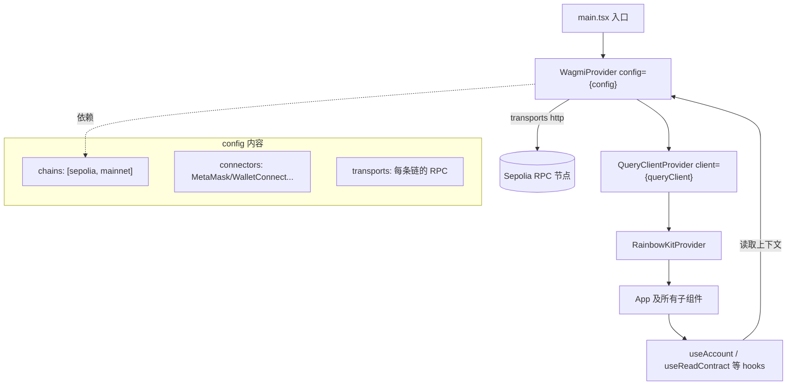

# 01 · Vite + wagmi 搭建 dApp 骨架（Setup Vite + wagmi）

> 用 Vite + React 起一个前端工程，配好 `WagmiProvider` + `QueryClient` + 链信息，让后续所有 wagmi hooks 都能工作。这是整套 dApp 的地基。

## 📖 知识讲解

一个 React dApp 想调用链上数据，必须先搭好三样东西：

1. **config（配置对象）**：告诉 wagmi「支持哪些链、用什么 RPC、允许哪些钱包连接方式」。由 `createConfig`（纯 wagmi）或 `getDefaultConfig`（RainbowKit 封装）创建。
2. **三层 Provider**：
   - `WagmiProvider`：注入 config，提供账户/链/连接器上下文。
   - `QueryClientProvider`：wagmi v2 底层用 [TanStack Query](https://tanstack.com/query) 管理链上数据的缓存、去重、自动刷新，所以必须包一层 QueryClient。
   - `RainbowKitProvider`：提供 `ConnectButton` 等开箱即用 UI 的主题上下文。
3. **transports**：每条链对应一个 RPC 端点（`http()`），wagmi 靠它和区块链节点通信。

> wagmi v2 与 v1 最大区别之一：v2 把数据层交给了 TanStack Query，所以**必须**有 `QueryClientProvider`，且 hook 名称从 `useContractRead` 改成了 `useReadContract` 这类新名字。

### createConfig vs getDefaultConfig

| | `createConfig`（wagmi 原生） | `getDefaultConfig`（RainbowKit） |
|---|---|---|
| connectors | 需手写 `injected/walletConnect/...` | 自动注册一批主流钱包 |
| 适用 | 想完全自定义连接 UI | 想直接用 RainbowKit 漂亮的连接弹窗 |

本教学工程统一用 `getDefaultConfig`。

## 🔄 流程图 / 原理图



## 💻 代码说明

- `wagmi.config.tsx`：并列展示两种配置写法。
  - **写法 A** `createConfig`：手动列出 `chains / connectors / transports`，看清底层做了什么。
  - **写法 B** `getDefaultConfig`：一句话搞定，推荐日常使用。
- 工程根 `src/wagmi.ts`：真正被应用使用的那份配置（写法 B）。
- 工程根 `src/main.tsx`：三层 Provider 的固定嵌套顺序。

## ▶️ 运行方式

```bash
# 在工程根 10-wagmi-rainbowkit/ 下
npm install
cp .env.example .env.local   # 填入你的 VITE_WALLETCONNECT_PROJECT_ID
npm run dev
```

浏览器打开终端提示的地址（默认 http://localhost:5173）。看到标题与连接按钮即说明骨架搭建成功。

## ⚠️ 常见坑 / 安全提示

- **Provider 顺序不能错**：`WagmiProvider` → `QueryClientProvider` → `RainbowKitProvider`，任何 hook 必须在这三层之内，否则报 “must be used within WagmiProvider”。
- **忘记引入样式**：`import '@rainbow-me/rainbowkit/styles.css'` 少了，连接弹窗会没样式。
- **只用测试网**：`chains` 里即使放了 `mainnet` 也仅用于演示切链，切记不要在主网操作真实资产。
- **projectId 不要写死真实值提交仓库**：放 `.env.local`（已 gitignore），用占位符兜底。
- **RPC 限流**：`http()` 默认公共 RPC 在高频请求下可能被限流，正式项目换成自己的 Infura/Alchemy 节点。

## 🔗 官方文档

- wagmi 快速开始：https://wagmi.sh/react/getting-started
- wagmi createConfig：https://wagmi.sh/react/api/createConfig
- RainbowKit 安装：https://www.rainbowkit.com/docs/installation
- TanStack Query：https://tanstack.com/query/latest
