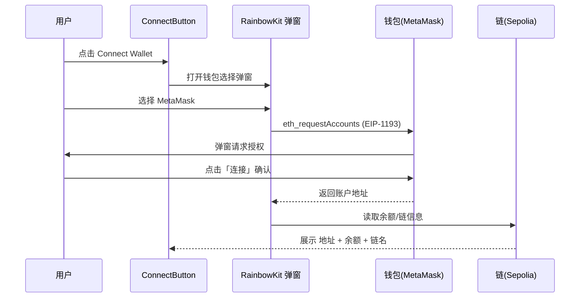

# 02 · RainbowKit 连接钱包按钮（ConnectButton）

> 用 RainbowKit 的 `<ConnectButton />`，一行代码得到一个功能完整、UI 精美的「连接钱包」入口。

## 📖 知识讲解

「连接钱包」是每个 dApp 的第一步。如果自己手写，需要处理：列出可用钱包、弹窗、监听连接状态、显示地址/余额、切链、断开……非常繁琐。

RainbowKit 把这些全部封装进了一个组件 `<ConnectButton />`：

- **未连接**：显示「Connect Wallet」按钮，点击弹出钱包选择框（MetaMask / Rainbow / Coinbase / WalletConnect 扫码…）。
- **已连接**：显示当前链、账户地址（带 ENS 头像）和余额，点击可查看详情或断开。
- **链不支持**：如果用户当前钱包所在链不在 config 的 `chains` 里，按钮会变成「Wrong network」提示切链。

它底层其实是调用 wagmi 的 `useConnect / useAccount / useDisconnect / useSwitchChain`，只是帮你把 UI 全做好了。

三种用法：
1. `<ConnectButton />`：默认，最省事。
2. `<ConnectButton showBalance={false} accountStatus="address" .../>`：用 props 微调显示。
3. `<ConnectButton.Custom>`：完全自定义外观，自己画按钮，RainbowKit 只给状态和打开弹窗的方法。

## 🔄 流程图 / 原理图

钱包连接遵循 EIP-1193 握手：



## 💻 代码说明

`ConnectButtonDemo.tsx` 展示三种用法：
- `ConnectButtonDemo`：默认按钮 + props 微调版。
- `CustomConnectButton`：`ConnectButton.Custom` render props 自定义外观，注意用 `mounted` 防止首帧渲染不一致。

> 前提：外层必须已包裹 `RainbowKitProvider`（见 01/`main.tsx`），否则组件无法工作。

## ▶️ 运行方式

把 `ConnectButtonDemo.tsx` 复制到工程 `src/examples/`，在 `src/App.tsx` 中 `import { ConnectButtonDemo }` 并渲染，然后：

```bash
npm run dev
```

点击按钮 → 选择 MetaMask → 授权 → 观察按钮变为已连接状态。

## ⚠️ 常见坑 / 安全提示

- **必须包 `RainbowKitProvider`**，且引入了 `styles.css`，否则弹窗无样式或报错。
- **WalletConnect 扫码需要 projectId**：没配 `projectId` 时扫码连接不可用，但 MetaMask 注入式连接仍能用。
- **只授权可信 dApp**：连接钱包本身不转账，但会暴露你的地址；对陌生站点保持警惕。
- **displayName / 头像来自 ENS**：测试网地址通常没有 ENS，显示为缩略地址属正常。

## 🔗 官方文档

- ConnectButton：https://www.rainbowkit.com/docs/connect-button
- 自定义 ConnectButton.Custom：https://www.rainbowkit.com/docs/custom-connect-button
- EIP-1193（钱包通信标准）：https://eips.ethereum.org/EIPS/eip-1193
