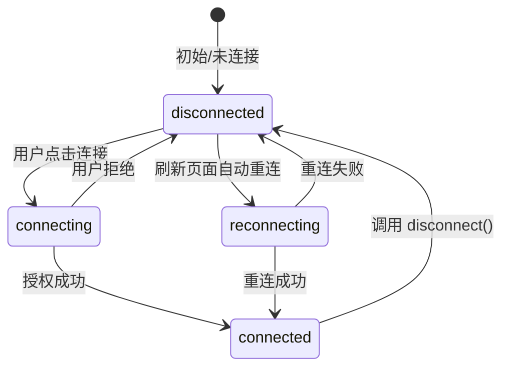

# 03 · useAccount —— 读取连接状态与地址

> `useAccount` 返回当前连接的账户地址、连接状态和所在链，是 dApp 中最高频的 hook。

## 📖 知识讲解

连接钱包后，你需要知道「谁连进来了、在哪条链上、连没连成功」。`useAccount()` 一次性给你这些：

| 返回值 | 含义 | 典型用途 |
|---|---|---|
| `address` | 当前账户地址 | 显示地址、作为读合约的入参 |
| `isConnected` | 是否已连接 | 条件渲染（连接前/后不同 UI） |
| `isConnecting` / `isReconnecting` | 连接中 / 重连中 | 显示 loading |
| `chain` / `chainId` | 当前链对象 / 链 id | 判断是否在正确的网络 |
| `connector` | 当前连接器 | 显示「通过 MetaMask 连接」 |
| `status` | 状态机字符串 | 精细控制 UI |

**响应式**：这是 hook 的关键。用户在钱包里切换账户、切换网络、断开连接，`useAccount` 都会让组件自动重渲染，无需手动监听事件。

搭配 `useDisconnect()` 可提供「断开」按钮。

## 🔄 流程图 / 原理图

`useAccount` 的 `status` 状态机：

## 💻 代码说明

`AccountInfo.tsx`：
- 解构 `useAccount()` 拿到全部常用字段。
- 用 `isConnecting / isReconnecting / isConnected` 三级判断做条件渲染，这是官方推荐的健壮写法。
- `useDisconnect()` 提供断开按钮。

> 注意：`address` 在未连接时是 `undefined`。把它传给 `useBalance({ address })`、`useReadContract` 时，wagmi 会自动在 address 为空时不发请求（配合 `query.enabled`），所以通常不会报错，但取值时记得用可选链 `?.`。

## ▶️ 运行方式

复制 `AccountInfo.tsx` 到 `src/examples/`，在 `App.tsx` 中渲染 `<AccountInfo />`，`npm run dev` 后连接钱包，尝试在 MetaMask 里切换账户/网络，观察页面自动更新。

## ⚠️ 常见坑 / 安全提示

- **不要用 `address` 是否有值判断连接**，用 `isConnected` 更准确（重连中途 address 可能短暂存在）。
- **`chain` 可能是 undefined**：当用户钱包所在链不在你的 `chains` 列表里时，`chain` 为 undefined，需引导切链（见 09）。
- **地址是公开信息**：显示地址无风险，但不要据此信任用户身份——想验证「地址确实归对方所有」需要签名（见 08）。

## 🔗 官方文档

- useAccount：https://wagmi.sh/react/api/hooks/useAccount
- useDisconnect：https://wagmi.sh/react/api/hooks/useDisconnect
