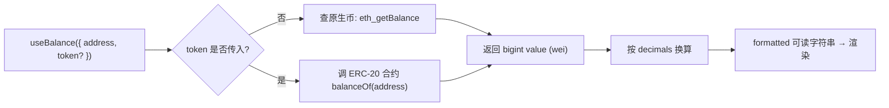

# 04 · useBalance —— 查询余额

> `useBalance` 查询某地址的原生币（ETH）或 ERC-20 代币余额，自动处理 `decimals` 换算。

## 📖 知识讲解

链上余额都是以最小单位的 **`bigint`** 存储的（ETH 的最小单位是 wei，1 ETH = 10¹⁸ wei）。直接展示这个大整数对用户没意义，需要按 `decimals` 换算成人类可读的数字。

`useBalance` 帮你把这一切做好，返回对象包含：

| 字段 | 含义 |
|---|---|
| `value` | 原始余额，`bigint`（如 wei） |
| `decimals` | 精度（ETH/多数 ERC-20 是 18） |
| `symbol` | 币种符号（ETH / USDC…） |
| `formatted` | 已换算好的可读字符串，**直接展示用这个** |

两种查询：
- **原生币**：`useBalance({ address })`，不传 token。
- **ERC-20**：`useBalance({ address, token: '0x代币合约地址' })`。

`useBalance` 返回的 `isLoading / isError / refetch` 来自底层 TanStack Query，可用于 loading 态与手动刷新。

## 🔄 流程图 / 原理图

## 💻 代码说明

`BalanceCard.tsx`：
- 用 `useBalance({ address })` 查原生币；`data.formatted` 直接展示。
- 演示 `token` 参数查 ERC-20，并用 `query.enabled` 控制何时发请求。
- 演示用 viem 的 `formatUnits(value, decimals)` 手动换算（等价于 `formatted`）。
- `isLoading / isError` 做状态渲染，`refetch()` 手动刷新。

## ▶️ 运行方式

复制 `BalanceCard.tsx` 到 `src/examples/` 并在 `App.tsx` 渲染。连接 Sepolia 钱包后即可看到测试 ETH 余额。没有测试币？去水龙头领：
- https://sepoliafaucet.com
- https://www.alchemy.com/faucets/ethereum-sepolia

## ⚠️ 常见坑 / 安全提示

- **展示用 `formatted`，计算用 `value`（bigint）**：绝不要把 `value` 转成 JS number 再算钱，会丢精度。
- **ERC-20 的 decimals 不一定是 18**：如 USDC 是 6。`useBalance` 已自动读取，别自己写死 18。
- **token 地址要在当前链上真实存在**，否则查询会报错或返回空。
- **余额是公开的**：查询他人地址余额无需授权，链上数据完全透明。

## 🔗 官方文档

- useBalance：https://wagmi.sh/react/api/hooks/useBalance
- viem formatUnits：https://viem.sh/docs/utilities/formatUnits
