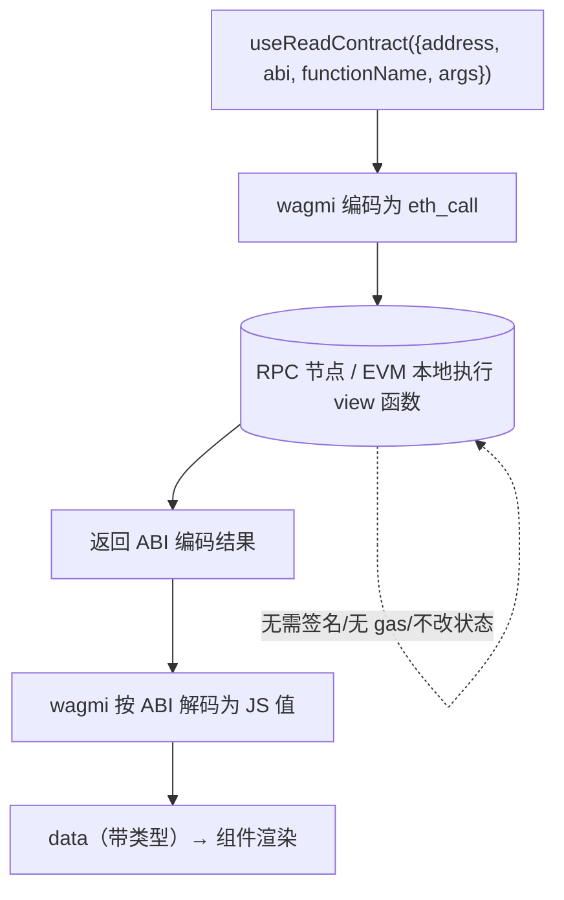

# 05 · useReadContract —— 读取智能合约

> `useReadContract` 调用合约的 `view`/`pure` 函数读取链上数据，**不花 gas、不用签名、不改状态**。

## 📖 知识讲解

合约函数分两类：
- **只读（view / pure）**：只查数据（如 `balanceOf`、`totalSupply`、`name`）。走 `eth_call`，本地节点计算即可返回，**免费、即时、无需签名**。→ 用 `useReadContract`。
- **写入（会改状态）**：如 `transfer`、`mint`。需要发交易、花 gas、签名、等上链。→ 用 `useWriteContract`（见 06）。

调用 `useReadContract` 需要四要素：

| 参数 | 说明 |
|---|---|
| `address` | 合约地址 |
| `abi` | 合约 ABI（只需包含要调用的函数） |
| `functionName` | 要调用的函数名 |
| `args` | 函数入参数组（无参可省略） |

**类型安全**：给 ABI 加 `as const`，wagmi + TypeScript 就能推断出 `functionName` 可选值、`args` 类型、`data` 返回类型，写错函数名会直接报错。

**批量读取**：`useReadContracts`（复数）可一次请求多个调用，减少往返、避免瀑布式加载。

返回的 `data / isLoading / isError / refetch` 来自 TanStack Query，还会**自动缓存并在区块更新时刷新**。

## 🔄 流程图 / 原理图

## 💻 代码说明

`ReadContractDemo.tsx`：
- 定义 `erc20Abi`（加 `as const` 获得类型推断）。
- 单次读取 `name`；带参读取 `balanceOf(address)`，用 `query.enabled` 控制连接后才查。
- `useReadContracts` 批量读 `symbol` + `decimals`。
- 用 `formatUnits` 把 `bigint` 余额换算展示。

## ▶️ 运行方式

1. 把 `TOKEN_ADDRESS` 换成 Sepolia 上一个真实 ERC-20 合约地址（可在 Remix 部署一个，见工程 05-openzeppelin / 06-token-standards 模块）。
2. 复制组件到 `src/examples/`，`App.tsx` 渲染 `<ReadContractDemo />`。
3. `npm run dev`，连接钱包即可看到读取结果。

## ⚠️ 常见坑 / 安全提示

- **hook 名是 `useReadContract`（v2）**，不是 v1 的 `useContractRead`，别搞混。
- **`as const` 不能少**：否则失去类型推断，`data` 会是 `unknown`。
- **返回值是 `bigint`**：`uint256` 解码成 JS 的 `bigint`，展示前用 `formatUnits` 换算，别直接 `Number()`。
- **读操作免 gas 但仍消耗 RPC 配额**：大量轮询会触发公共节点限流，必要时调整 `query.refetchInterval` 或换自有节点。
- **读到的是链上真实数据**，无安全风险；风险都在「写」（见 06）。

## 🔗 官方文档

- useReadContract：https://wagmi.sh/react/api/hooks/useReadContract
- useReadContracts（批量）：https://wagmi.sh/react/api/hooks/useReadContracts
