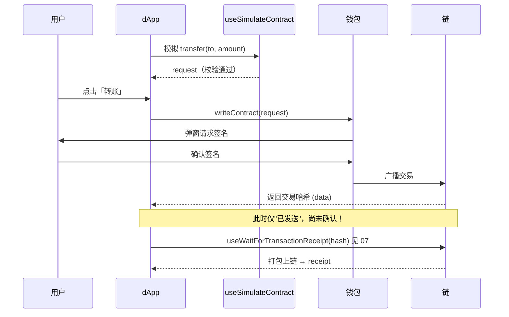

# 06 · useWriteContract —— 写合约 / 发交易

> `useWriteContract` 调用会改变链上状态的合约函数（`transfer`、`approve`、`mint`…），需要钱包签名、消耗 gas、等待上链。

## 📖 知识讲解

「写」和「读」有本质区别：

| | 读（useReadContract） | 写（useWriteContract） |
|---|---|---|
| 改变状态 | 否 | 是 |
| gas | 不花 | 要花 |
| 签名 | 不用 | 必须（钱包弹窗） |
| 即时性 | 立即返回 | 要等矿工打包上链 |

`useWriteContract` 返回：
- `writeContract(...)`：触发写操作的函数，调用后钱包弹窗让用户签名。
- `data`：**交易哈希**。注意——拿到哈希只代表「交易已广播」，**不代表已确认上链**！确认要靠 07 的 `useWaitForTransactionReceipt`。
- `isPending`：等待用户在钱包里确认的阶段。
- `error`：报错（用户拒签、gas 不足、合约 revert…）。

**写前先 simulate（强烈推荐）**：`useSimulateContract` 会本地模拟这笔交易。若会失败（如余额不足、无授权），提前报错，避免用户白白花 gas 发一笔注定 revert 的交易。模拟成功后把 `simulateData.request` 直接喂给 `writeContract`。

**单位换算**：金额入参是 `bigint`，用 viem 的 `parseUnits('1', 18)` 把可读数字转成最小单位。

## 🔄 流程图 / 原理图

## 💻 代码说明

`WriteContractDemo.tsx`：
- `useSimulateContract` 先模拟 `transfer`，成功后把 `request` 传给 `writeContract`。
- `useWriteContract` 拿到 `writeContract / hash / isPending / error`。
- 按钮 `disabled={isPending}` 防重复点击；展示交易哈希与错误的 `shortMessage`。

## ▶️ 运行方式

1. 把 `TOKEN_ADDRESS` 换成你在 Sepolia 部署/持有的 ERC-20 合约地址（否则模拟会失败）。
2. 复制组件到 `src/examples/`，`App.tsx` 渲染。
3. `npm run dev`，连接钱包 → 点击按钮 → 在 MetaMask 里确认签名 → 得到交易哈希。
4. 配合 07 模块观察确认过程。

## ⚠️ 常见坑 / 安全提示

- **hook 名是 `useWriteContract`（v2）**，非 v1 的 `useContractWrite`。
- **拿到 `hash` ≠ 交易成功**：必须用 07 的 receipt 才能确认最终成败（可能上链后 revert）。
- **务必先 simulate**：跳过模拟直接写，遇到会 revert 的交易用户会白花 gas。
- **金额用 `parseUnits`**：直接传 JS number 会因精度/单位错误转错金额。
- **安全红线**：写操作真的会动资产。教学一律用 **Sepolia 测试网 + 测试代币**；`approve` 授权要警惕「无限授权」钓鱼——只授权必要额度，用完及时撤销（revoke.cash）。
- **合约未经审计勿上主网**。

## 🔗 官方文档

- useWriteContract：https://wagmi.sh/react/api/hooks/useWriteContract
- useSimulateContract：https://wagmi.sh/react/api/hooks/useSimulateContract
- viem parseUnits：https://viem.sh/docs/utilities/parseUnits
