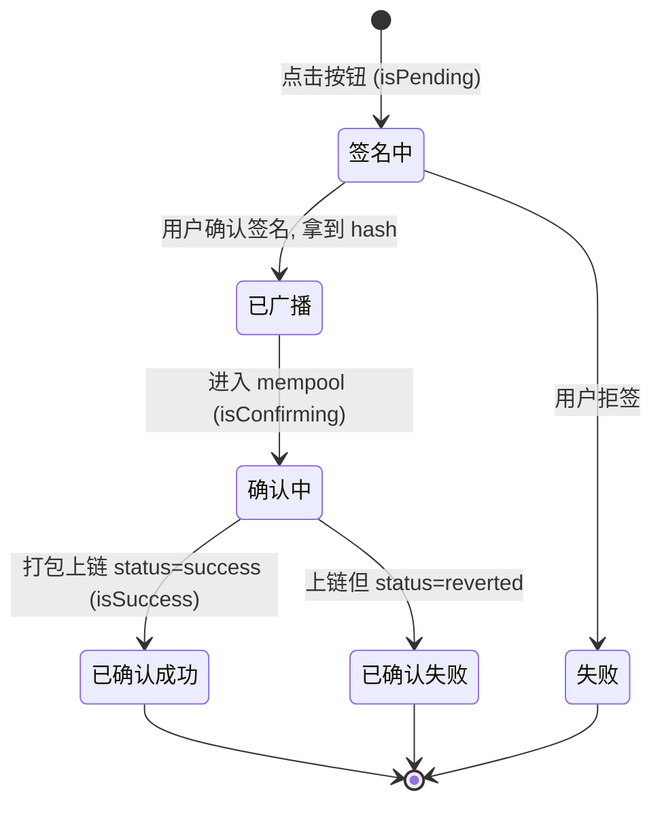

# 07 · useWaitForTransactionReceipt —— 等待交易确认

> 发出交易只拿到哈希，交易还在排队。`useWaitForTransactionReceipt` 帮你等到交易被打包上链，拿到收据（receipt），是做「上链中…」loading 与成功/失败提示的核心。

## 📖 知识讲解

一笔交易要经历这几个阶段：

1. **签名中**（`isPending`）：钱包弹窗，等用户点确认。
2. **已广播**：拿到 `hash`，交易进入内存池（mempool）排队。**此时还没成功！**
3. **确认中**（`isConfirming` / `isLoading`）：等矿工/验证者把它打包进区块。
4. **已确认**（`isConfirmed` / `isSuccess`）：拿到 **receipt**，交易最终完成。

很多新手错误地以为「拿到 hash = 转账成功」，于是提前提示成功。正确做法是把 `hash` 交给 `useWaitForTransactionReceipt`，用它的 `isLoading/isSuccess` 驱动 UI。

**receipt 里有什么**：`blockNumber`（在哪个区块）、`gasUsed`（实际耗 gas）、`status`（`'success'` / `'reverted'`——注意交易上链了也可能是 reverted 失败！）、`logs`（事件日志）等。

## 🔄 流程图 / 原理图

## 💻 代码说明

`TxReceiptDemo.tsx`：
- 用 `useSendTransaction` 发一笔原生币转账，拿到 `hash`（写合约同理，把 `useWriteContract` 的 `hash` 传进来即可）。
- `useWaitForTransactionReceipt({ hash })` 返回 `isConfirming / isConfirmed / receipt`。
- 按钮文案随 `isPending → isConfirming → 完成` 三阶段变化，`disabled` 防重复提交。
- 成功后展示区块号与 `receipt.status`。

## ▶️ 运行方式

复制 `TxReceiptDemo.tsx` 到 `src/examples/`，`App.tsx` 渲染。连接 Sepolia 钱包（需有测试 ETH），点击按钮，观察「钱包确认中 → 上链确认中 → 已确认」的完整流程。

## ⚠️ 常见坑 / 安全提示

- **hash ≠ 成功**：一定要等 receipt。且 receipt 的 `status` 可能是 `'reverted'`——上链了但执行失败，务必判断。
- **hash 为 undefined 时 hook 自动不查**：未发交易前 `useWaitForTransactionReceipt` 处于空闲，不会报错。
- **测试网确认慢**：Sepolia 出块约 12 秒，`isConfirming` 可能持续十几秒，属正常。
- **不要在 confirming 期间允许重复点击**：用 `disabled={isPending || isConfirming}` 防止用户重复发交易。
- **确认后记得刷新相关读数据**：交易改了链上状态后，调用 `refetch()` 或让 TanStack Query 失效以更新余额等。

## 🔗 官方文档

- useWaitForTransactionReceipt：https://wagmi.sh/react/api/hooks/useWaitForTransactionReceipt
- useSendTransaction：https://wagmi.sh/react/api/hooks/useSendTransaction
