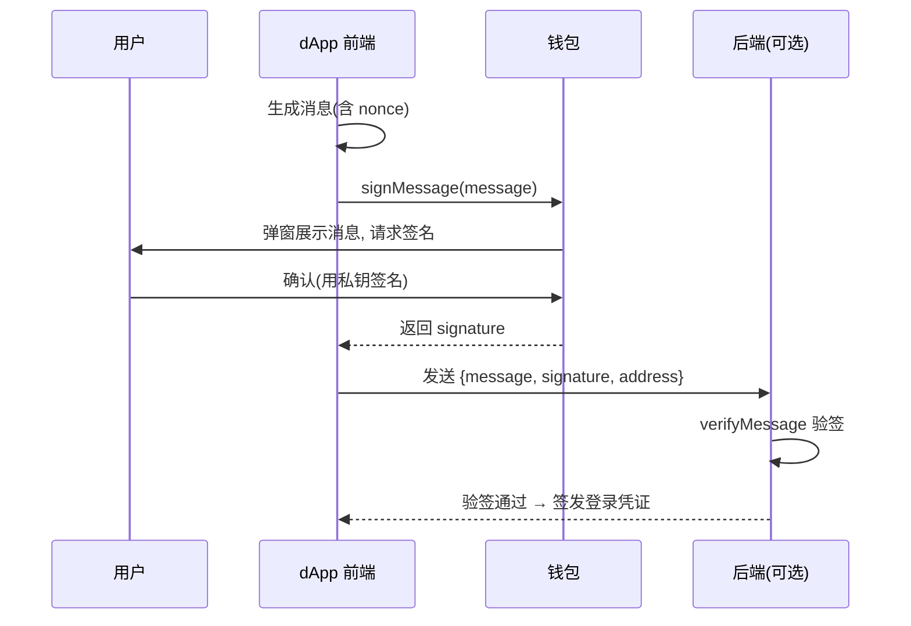

# 08 · useSignMessage —— 消息签名

> `useSignMessage` 让用户用钱包私钥对一段消息签名，用于「用钱包登录」等身份验证场景。签名**不上链、不花 gas、不动资产**。

## 📖 知识讲解

签名的本质是**密码学身份证明**：用私钥对消息生成签名，任何人可用签名者的地址来验证「这条消息确实由该地址的私钥持有者签发」，且无法伪造。

最典型的用途是 **Sign-In with Ethereum（SIWE，钱包登录）**：
1. 后端生成一段带随机 `nonce` 的消息。
2. 前端用 `useSignMessage` 让用户签名。
3. 后端用签名 + 地址验签，通过则签发 session/JWT。

这样用户**无需密码**、无需上链、零 gas，就证明了「我拥有这个地址」。

`useSignMessage` 返回：
- `signMessage` / `signMessageAsync`：触发签名（后者返回 Promise，便于拿到结果继续处理）。
- `data`：签名字符串（0x…）。
- `isPending` / `error`。

验签用 viem 的 `verifyMessage({ address, message, signature })`。

## 🔄 流程图 / 原理图

## 💻 代码说明

`SignMessageDemo.tsx`：
- 构造带地址与时间戳的消息（真实场景还要加后端下发的随机 `nonce` 防重放）。
- `signMessageAsync({ message })` 拿到签名。
- 用 `verifyMessage` 在前端演示验签（生产应放后端）。
- `isPending` 驱动按钮 loading，捕获用户拒签等错误。

## ▶️ 运行方式

复制 `SignMessageDemo.tsx` 到 `src/examples/`，`App.tsx` 渲染。连接钱包 → 点击签名 → 在 MetaMask 里查看消息并确认 → 看到签名与「验签通过」。

## ⚠️ 常见坑 / 安全提示

- **签名 ≠ 交易**：签名不上链、不花 gas、不转账。但——
- **警惕钓鱼签名**：恶意站点可能诱导你签一段「看起来无害」实则是授权转账的结构化数据（如 Permit、`eth_signTypedData`）。**签名前务必看清钱包弹窗里的内容**，不明来源不要签。
- **防重放**：登录消息必须含随机 `nonce`（一次性）+ 域名 + 过期时间，否则签名可能被重复使用。生产建议直接用成熟的 SIWE 库。
- **验签要在后端**：前端验签只是演示，真正的鉴权必须服务端完成。
- **`personal_sign` vs `signTypedData`**：本例是普通文本签名（`personal_sign`）；涉及授权/交易意图请了解 EIP-712 结构化签名的风险。

## 🔗 官方文档

- useSignMessage：https://wagmi.sh/react/api/hooks/useSignMessage
- viem verifyMessage：https://viem.sh/docs/utilities/verifyMessage
- Sign-In with Ethereum（EIP-4361）：https://eips.ethereum.org/EIPS/eip-4361
