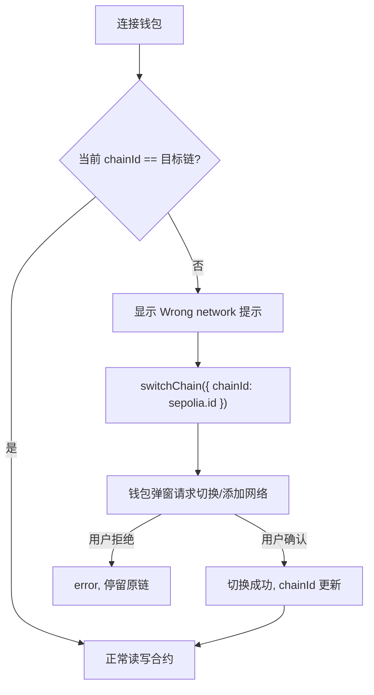

# 09 · useSwitchChain —— 切换网络

> `useSwitchChain` 请求钱包从当前链切换到目标链。当用户所在网络不对时（如 dApp 只支持 Sepolia），用它引导切链。

## 📖 知识讲解

同一个钱包地址可以在很多条链上（以太坊主网、Sepolia、Polygon、Base…）。但 dApp 的合约只部署在特定链上——如果用户钱包停在错误的链，读写合约都会失败。

处理方式：
1. 用 `useChainId()` 或 `useAccount().chainId` 拿到当前链。
2. 和 dApp 要求的链对比，不一致就提示并调用 `switchChain`。

`useSwitchChain` 返回：
- `chains`：你在 config 里配置的、可切换的链列表。
- `switchChain({ chainId })`：请求切换，钱包会弹窗让用户确认（若钱包没有该网络，会请求添加）。
- `isPending` / `error`：切换中 / 出错（用户拒绝、钱包不支持等）。

> RainbowKit 的 `<ConnectButton />` 其实已内置「Wrong network」切链提示，底层就是调用它。手动用 `useSwitchChain` 适合需要自定义交互的场景。

## 🔄 流程图 / 原理图

## 💻 代码说明

`SwitchChainDemo.tsx`：
- 用 `useChainId` + `useAccount().chain` 展示当前网络。
- 判断是否在 Sepolia，不在则给出橙色警告。
- 遍历 `chains` 生成切换按钮；当前链的按钮 `disabled`。
- 额外提供「一键切到 Sepolia」按钮。
- `isPending` 做 loading，捕获切换错误。

## ▶️ 运行方式

复制 `SwitchChainDemo.tsx` 到 `src/examples/`，`App.tsx` 渲染。连接钱包后，如果当前在主网就点「切到 Sepolia」，在 MetaMask 弹窗里确认，观察页面网络名称变化。

## ⚠️ 常见坑 / 安全提示

- **目标链必须在 config 的 `chains` 里**：没配置的链无法切换（`chains` 列表也不会包含它）。
- **钱包可能没有该网络**：某些钱包需要先「添加网络」，`switchChain` 通常会触发添加流程，但个别钱包可能失败，需 catch `error`。
- **切链后数据要刷新**：链变了，余额/合约读数全变，依赖链的 `useReadContract`/`useBalance` 会自动重查，但要留意 loading 态。
- **教学只在测试网间演示**：即使 config 里放了 mainnet，也不要在主网做真实操作。
- **别信任前端链状态做安全判断**：真正的链校验应在合约层（如 `require(block.chainid == ...)`）。

## 🔗 官方文档

- useSwitchChain：https://wagmi.sh/react/api/hooks/useSwitchChain
- useChainId：https://wagmi.sh/react/api/hooks/useChainId
- RainbowKit 链切换：https://www.rainbowkit.com/docs/chains
