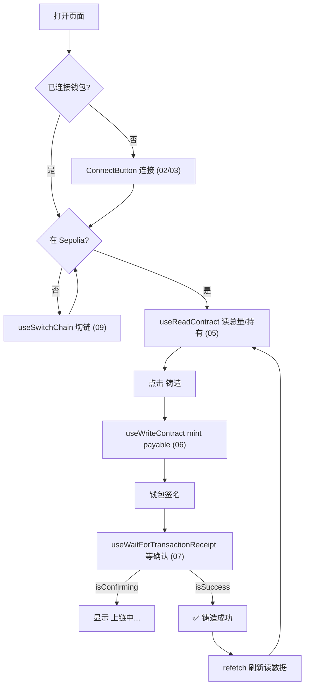

# 10 · 综合实战 —— 连钱包 → mint NFT 完整小页面

> 把 02~09 的所有知识点串成一个最小可用的 NFT 铸造 dApp：连钱包 → 校验链 → 读合约 → 写合约 mint → 等待确认 → 刷新。

## 📖 知识讲解

一个真实 dApp 的核心交互闭环，正是本模块要走通的流程。它综合运用了：

| 环节 | 用到的 hook / 组件 | 模块 |
|---|---|---|
| 连接钱包 | `<ConnectButton />` | 02 |
| 读连接状态/地址 | `useAccount` | 03 |
| 校验并切换到正确链 | `useChainId` + `useSwitchChain` | 09 |
| 读合约（总量/持有数） | `useReadContract` | 05 |
| 写合约（付费 mint） | `useWriteContract` | 06 |
| 等待交易确认 | `useWaitForTransactionReceipt` | 07 |
| 确认后刷新数据 | `refetch()` | 04/05 |

**mint 是 `payable` 函数**：铸造要付费，所以 `writeContract` 时带 `value: parseEther('0.001')`，把铸造费随交易发送出去。

**完整状态机**：按钮文案随「钱包确认中 → 铸造上链中 → 成功」变化，给用户清晰反馈；成功后 `refetch` 让「已铸造总量 / 我的持有」自动更新。

## 🔄 流程图 / 原理图



## 💻 代码说明

`MintNftDapp.tsx` 是单文件完整实现：
- 顶部 `<ConnectButton />` 负责连接。
- 分支渲染：未连接 → 提示；链不对 → 切链按钮；就绪 → 展示数据 + 铸造按钮。
- `useReadContract` 读 `totalSupply` / `balanceOf`，用 `query.enabled` 控制在正确链且已连接时才查。
- `useWriteContract` 调 `mint`，带 `value` 付费。
- `useWaitForTransactionReceipt` 驱动三段式按钮文案，`isConfirmed` 后 `refetch` 刷新。

> 需替换 `NFT_ADDRESS` 与 `nftAbi` 为你自己在 Sepolia 部署的 NFT 合约。可用 OpenZeppelin 的 ERC-721 模板在 Remix 部署（见本仓库 `05-openzeppelin` / `06-token-standards`）。

## ▶️ 运行方式

1. 在 Sepolia 部署一个带 `mint() payable`、`totalSupply()`、`balanceOf()` 的 ERC-721 合约，拿到地址。
2. 把 `NFT_ADDRESS` / `nftAbi` / `MINT_PRICE` 改成你合约的实际值。
3. 复制 `MintNftDapp.tsx` 到 `src/examples/`，在 `App.tsx` 渲染 `<MintNftDapp />`。
4. 工程根执行：
   ```bash
   npm install
   cp .env.example .env.local   # 填 VITE_WALLETCONNECT_PROJECT_ID
   npm run dev
   ```
5. 连接钱包（备好 Sepolia 测试 ETH）→ 铸造 → 观察完整流程。

## ⚠️ 常见坑 / 安全提示

- **payable 一定要带 `value`**：mint 价格不对（多付/少付）会被合约 `require` 拒绝。
- **`refetch` 放在渲染体里要小心**：本例为教学简洁在 `isConfirmed` 时直接调用；生产中应放进 `useEffect(() => {...}, [isConfirmed])` 避免重复触发。
- **hash ≠ 成功**：务必等 receipt；上链也可能 revert（如售罄、超额）。
- **只用测试网**：真实 NFT mint 会花真金白银，这里全程 Sepolia 测试币。
- **合约未审计勿上主网**；`mint` 若无数量/权限限制易被滥用。
- **projectId 用占位符**，真实值放 `.env.local`（已 gitignore），勿提交。

## 🔗 官方文档

- wagmi 全部 hooks：https://wagmi.sh/react/api/hooks
- RainbowKit ConnectButton：https://www.rainbowkit.com/docs/connect-button
- OpenZeppelin ERC-721：https://docs.openzeppelin.com/contracts/5.x/erc721
