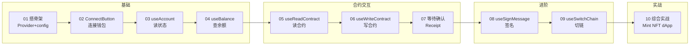

# 10 · wagmi + RainbowKit（React dApp 前端）

> 用 **wagmi v2 + viem + TanStack Query + RainbowKit**，在 React 里优雅地连接钱包、读写智能合约、发交易、签名、切链，最终做出一个完整的 NFT 铸造 dApp。全程 **Sepolia 测试网**，不碰真实资产。

## 📖 wagmi / RainbowKit 简介

- **wagmi**：React Hooks 形态的以太坊交互库。把「连接钱包、读余额、读写合约、发交易、签名」等操作封装成 `useAccount`、`useReadContract`、`useWriteContract` 等 hook，响应式、类型安全。v2 版底层用 **viem**（现代以太坊工具库）+ **TanStack Query**（数据缓存）。
- **RainbowKit**：基于 wagmi 的钱包连接 UI 库。一个 `<ConnectButton />` 就给你精美的钱包选择弹窗、账户展示、切链提示，省去手写连接 UI。
- **viem**：wagmi 的底层，提供 `parseEther / formatUnits / verifyMessage` 等工具与编解码能力。
- **TanStack Query**：wagmi v2 用它做链上数据的缓存、去重、自动刷新——所以必须有 `QueryClientProvider`。

> ⚠️ 版本要点：本工程用 **wagmi v2**，hook 名与 v1 不同（`useReadContract` 而非 `useContractRead`、`useWriteContract` 而非 `useContractWrite`），务必对照官方最新文档。

## 🗂️ 模块索引

| 模块 | 知识点 | 核心 API | 说明 |
|---|---|---|---|
| [01](./01-setup-vite-wagmi/) | Vite + wagmi 搭骨架 | `createConfig` / `getDefaultConfig` / 三层 Provider | 地基：配链、RPC、连接器 |
| [02](./02-rainbowkit-connect-button/) | 连接钱包按钮 | `<ConnectButton />` | 一行代码搞定连接 UI |
| [03](./03-useAccount/) | 读连接状态/地址 | `useAccount` / `useDisconnect` | 谁连进来了、在哪条链 |
| [04](./04-useBalance/) | 查余额 | `useBalance` | 原生币 & ERC-20 余额 |
| [05](./05-useReadContract/) | 读合约 | `useReadContract` / `useReadContracts` | view/pure，免 gas |
| [06](./06-useWriteContract/) | 写合约/发交易 | `useWriteContract` / `useSimulateContract` | 改状态，花 gas，需签名 |
| [07](./07-useWaitForTransactionReceipt/) | 等待确认 | `useWaitForTransactionReceipt` | loading 态与成功/失败 |
| [08](./08-useSignMessage/) | 消息签名 | `useSignMessage` | 钱包登录，不上链 |
| [09](./09-switch-chain/) | 切链 | `useSwitchChain` / `useChainId` | 引导切到正确网络 |
| [10](./10-mint-nft-dapp/) | 综合实战 | 以上全部 | 连钱包 → mint NFT 完整页面 |

## 🧭 学习路线



## ⚙️ Vite 工程运行说明

### 目录结构

```
10-wagmi-rainbowkit/
├── package.json          ← 依赖与脚本
├── vite.config.ts        ← Vite + React 插件
├── tsconfig.json
├── index.html            ← 挂载点
├── .env.example          ← 复制为 .env.local 填 projectId
├── src/
│   ├── main.tsx          ← 入口：WagmiProvider→QueryClientProvider→RainbowKitProvider 三层
│   ├── wagmi.ts          ← 全局 config（getDefaultConfig，Sepolia）
│   ├── App.tsx           ← 装配各模块示例组件
│   └── examples/         ← 放从各模块复制过来的 .tsx 示例
└── NN-xxx/               ← 10 个教学模块（README + .tsx 源码）
```

### 启动步骤

```bash
# 1. 进入工程目录
cd 10-wagmi-rainbowkit

# 2. 安装依赖（wagmi/viem/@tanstack/react-query/@rainbow-me/rainbowkit）
npm install

# 3. 配置 WalletConnect projectId（到 https://cloud.reown.com 免费申请）
cp .env.example .env.local
# 编辑 .env.local，把 VITE_WALLETCONNECT_PROJECT_ID 换成你的 ID
# （不填也能用 MetaMask 等注入式钱包，只是扫码连接不可用）

# 4. 启动开发服务器
npm run dev
# 打开终端提示的地址（默认 http://localhost:5173）
```

### 如何运行某个模块的示例

1. 打开该模块目录（如 `05-useReadContract/`），把里面的 `*.tsx` 组件复制到 `src/examples/`。
2. 在 `src/App.tsx` 顶部 `import { ReadContractDemo } from './examples/ReadContractDemo'`。
3. 在 `App` 的 JSX 里渲染 `<ReadContractDemo />`。
4. 若模块涉及合约，记得把源码里的合约地址/ABI 换成你在 Sepolia 上的真实合约。
5. 保存后 Vite 热更新，浏览器即时生效。

### 准备工作

- **钱包**：安装 [MetaMask](https://metamask.io)，切到 Sepolia 测试网。
- **测试币**：到水龙头领 Sepolia ETH：https://sepoliafaucet.com 或 https://www.alchemy.com/faucets/ethereum-sepolia
- **projectId**：https://cloud.reown.com （原 WalletConnect Cloud）免费申请。

## ⚠️ 安全底线

- **只用测试网**（Sepolia）+ 水龙头测试币，**绝不使用主网真实资产**。
- **绝不把真实私钥/助记词/API Key/projectId 写进代码提交**；用 `.env.local`（已 gitignore）。
- **签名/授权有风险**：警惕钓鱼签名与无限授权，签名前看清钱包弹窗内容（见 08）。
- **示例合约教学用途、未经审计，勿直接上主网**。

## 🔗 官方文档

- wagmi：https://wagmi.sh/react/getting-started
- RainbowKit：https://www.rainbowkit.com/docs/introduction
- viem：https://viem.sh
- TanStack Query：https://tanstack.com/query/latest
- Reown（WalletConnect）Cloud：https://cloud.reown.com
