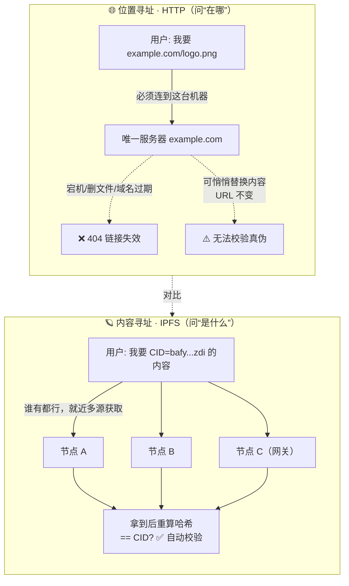

# 01 · IPFS 是什么（What is IPFS）

> IPFS（InterPlanetary File System，星际文件系统）是一套**点对点的分布式文件系统协议**。它用「内容寻址」取代传统 Web 的「位置寻址」：你不再问「文件在哪台服务器」，而是问「我要的内容是什么」。

## 📖 知识讲解

### 传统 Web 的痛点：位置寻址（Location Addressing）

在 HTTP 世界里，一个 URL 指向的是「**位置**」：

```
https://example.com/logo.png
```

它的含义是「去 `example.com` 这台服务器、`/logo.png` 这个路径拿文件」。问题在于：

- **中心化**：内容只存在于某台（某几台）服务器上，服务器宕机 / 域名过期 / 文件被删，链接就 404。
- **无法校验**：你无法确认拿到的 `logo.png` 是不是原始文件，服务器可以偷偷替换内容，URL 却一模一样。
- **重复浪费**：同一个文件在全球被无数服务器各存一份，彼此不知道对方存了相同内容。

### IPFS 的方案：内容寻址（Content Addressing）

IPFS 给每一份内容算一个基于**加密哈希**的指纹，叫 **CID（Content Identifier，内容标识符）**：

```
ipfs://bafybeigdyrzt5sfp7udm7hu76uh7y26nf3efuylqabf3oclgtqy55fbzdi
```

这个地址的含义变成「给我**哈希等于这个值**的内容，谁有都行」。带来三个根本变化：

| 特性 | 含义 |
| --- | --- |
| **内容即地址** | 地址由内容本身的哈希算出，内容不变则地址不变，内容一变地址就变。 |
| **自校验（self-verifying）** | 拿到数据后重新算哈希，能和 CID 比对，篡改一个字节都会被发现。 |
| **去重 & 分发** | 相同内容全网只有一个 CID；任何持有该内容的节点都能提供它，天然多源、抗单点故障。 |

### IPFS 不是「区块链」

常见误解：IPFS 把文件存在区块链上。**并不是**。IPFS 是一个 P2P 文件网络，文件存在各个**节点**的本地磁盘里，通过 DHT（分布式哈希表）互相发现。它常和区块链搭配（如把 NFT 图片存 IPFS、链上只存 `ipfs://` 地址），但它本身没有链、没有共识、没有代币。持久性由 **Pinning（固定）** 和 **Filecoin** 等激励层来保证（见 05、08 模块）。

### 数据结构：Merkle DAG

IPFS 底层用 **Merkle DAG（默克尔有向无环图）** 组织数据：大文件被切成块（chunk），每块单独算哈希，再把这些哈希组织成一棵有向无环图，根节点的 CID 就代表整份文件/目录。这让 IPFS 天然支持去重、增量更新、按块并行下载与校验。

## 🔄 流程图 / 原理图

### 位置寻址 vs 内容寻址（核心对比）



要点：HTTP 把「内容」和「某台服务器的位置」绑死；IPFS 把「内容」和「它的哈希」绑死，任何持有者都能服务同一份内容，且拿到就能自校验。

## 💻 代码说明

`index.html`：浏览器打开即可运行，无需安装。它演示两件事：

1. 用 `crypto.subtle`（浏览器内置）对你输入的文本算 SHA-256 哈希 —— 直观感受「内容 → 指纹」的映射：改一个字符，指纹完全变。这正是内容寻址的核心直觉（真实 CID 在 02 模块细讲，比裸哈希多了版本/编码等元数据）。
2. 用**公共网关** `https://ipfs.io/ipfs/<CID>` 从 IPFS 网络读取一份真实内容，演示「只凭 CID、不指定服务器」就能取到数据。

## ▶️ 运行方式

直接用浏览器打开：

```bash
open 01-what-is-ipfs/index.html      # macOS
# 或双击文件，或在 VS Code 里用 Live Server 打开
```

在输入框改文字，观察哈希变化；点击「从 IPFS 网关读取」按钮，看到通过 CID 取回的真实内容。

## ⚠️ 常见坑 / 安全提示

- **IPFS ≠ 加密**：默认情况下，添加到 IPFS 的内容是**公开的**，任何知道 CID 的人都能读取。**绝不要**把私钥、助记词、隐私数据直接上 IPFS。需要保密就先自行加密再上传。
- **IPFS ≠ 永久**：内容能被持续访问，前提是**至少有一个节点还 pin 着它**。没人 pin，节点垃圾回收后就取不到了。持久化要靠 Pinning 服务 / Filecoin（05、08 模块）。
- **添加即不可撤销地公开哈希**：内容一旦被别人 pin/缓存，你无法「从全网删除」。发布前想清楚。
- 公共网关是**便利工具不是承诺**：可能限速、可能下线，生产别硬依赖单一网关（04 模块讲多网关与自建）。

## 🔗 官方文档

- IPFS 概念总览：https://docs.ipfs.tech/concepts/
- 内容寻址：https://docs.ipfs.tech/concepts/content-addressing/
- IPFS 与区块链的关系：https://docs.ipfs.tech/concepts/how-ipfs-works/
- Merkle DAG：https://docs.ipfs.tech/concepts/merkle-dag/
