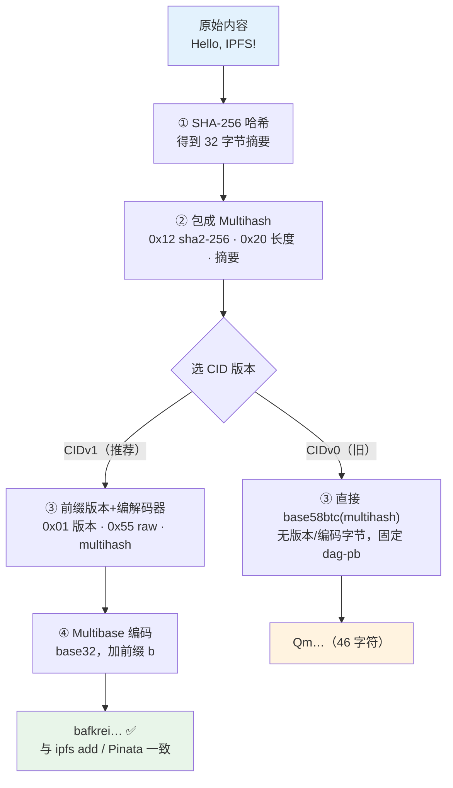

# 02 · CID 内容标识符（Content Identifier）

> CID 是 IPFS 里每一份内容的「身份证」。它由内容的**加密哈希**外加一组**自描述元数据**（版本、编解码器、哈希算法、编码方式）拼成，因此看一眼 CID 就知道该怎么解读它。

## 📖 知识讲解

### CID 不只是「哈希」

很多人以为 CID = 文件的哈希值。**不准确**。CID = 哈希 + 一层「自描述」的元数据。官方原话：*CID 不会等于数据的哈希，因为 CID 在哈希之外还包含结构性元数据*。这层元数据由三个 `multiformats` 规范组成：

| 组成 | 作用 | 例子 |
| --- | --- | --- |
| **Multihash** | 说明「用哪种哈希算法、摘要多长」 | `0x12`=sha2-256，`0x20`=32 字节 |
| **Multicodec** | 说明「里面的数据该怎么解读」 | `0x55`=raw（裸字节），`0x70`=dag-pb（UnixFS） |
| **Multibase** | 说明「字符串用哪种进制编码」 | `b`=base32，CIDv0 用 base58btc |

自描述的好处：未来换哈希算法（如 blake3）、换编码，老 CID 依然能被正确识别，不会歧义。

### CID 的字节结构

一个 **CIDv1** 的二进制布局：

```
<multibase 前缀>  <version>  <multicodec>  <multihash>
      b            0x01         0x55        0x12 0x20 <32字节摘要>
     (base32)     (v1)         (raw)       (sha2-256, len=32)
```

CIDv0 是历史遗留的简化版：**只有 multihash 本体**，用 base58btc 编码，固定表示 dag-pb，没有版本/编码字节，所以永远以 `Qm` 开头、长 46 字符。

### CIDv0 vs CIDv1

| | CIDv0 | CIDv1 |
| --- | --- | --- |
| 开头 | `Qm…`（固定） | `bafy…`(dag-pb) / `bafk…`(raw) 等 |
| 长度 | 固定 46 字符 | 变长 |
| 编码(multibase) | 仅 base58btc | 可选，默认 base32 |
| 编解码器(codec) | 仅 dag-pb | 任意（raw / dag-pb / dag-cbor …） |
| 大小写 | 混合大小写 | base32 全小写，**对子域名网关友好** |
| 官方建议 | 兼容旧数据 | **新项目一律用 CIDv1**（更面向未来、浏览器/子域名网关安全） |

> ⚠️ 同一份文件，可能算出**不同的 CID**——取决于分块策略、DAG 布局、codec、哈希算法。这不是 bug，是灵活性。所以「CID 相同 ⇒ 内容一定相同」成立，但「内容相同 ⇒ CID 一定相同」**不一定**（除非用完全相同的添加参数）。

### 为什么小文件的 CID 能自己算出来

对一个**小于分块阈值（默认 256 KiB）的单块文件**，若用 `raw` 叶子（`--raw-leaves`），根 CID 就等于「该裸字节块的 CIDv1(raw)」，可以纯靠 sha256 + 拼字节 + base32 算出，**无需安装 IPFS**。Pinata 公共上传返回的 `bafkrei…` 正是这种。本模块 `demo.js` 就现场把它算出来，并能和官方工具对上。

（大文件/目录会被切块、用 UnixFS(dag-pb) 组织成 Merkle DAG，根 CID 依赖分块与 DAG 结构，就不能这么简单手算了。）

## 🔄 流程图 / 原理图

### 从内容到 CID 的生成过程



## 💻 代码说明

`demo.js`（纯 Node 内置模块，零依赖）逐步演示：

1. 对内容算 **SHA-256** → 32 字节摘要；
2. 拼成 **multihash**（`0x12 0x20` + 摘要）；
3. 拼成 **CIDv1(raw)** 字节（`0x01 0x55` + multihash）并 **base32** 编码 → `bafkrei…`；
4. 同一个 multihash 用 **base58btc** 编码，展示 **CIDv0** 的样子（`Qm…`）；
5. 给内容加一个空格，展示「一字之差、CID 天翻地覆」。

关键点：第 3 步的结果，与官方 `ipfs add --cid-version=1 --raw-leaves` 及 Pinata 公共上传对小文件**逐字节一致**——这是可验证的真实结果，不是模拟。

## ▶️ 运行方式

```bash
cd 02-cid
node demo.js                       # 用默认内容 "Hello, IPFS!\n"
node demo.js 任意你想算的文本        # 传入自定义内容
```

想亲自对账（可选，需已安装 IPFS）：

```bash
printf %s "Hello, IPFS!\n" | ipfs add --cid-version=1 --raw-leaves -Q
# 输出应与 demo.js 打印的 CIDv1 完全一致
```

## ⚠️ 常见坑 / 安全提示

- **别把 CID 当哈希直接比对**：CID 含元数据，`sha256(file)` 的十六进制值 ≠ CID。要比对请用 CID 对 CID。
- **CIDv0 与 CIDv1 可互转但不是同一串**：同一 dag-pb 内容的 v0/v1 可无损转换（`ipfs cid base32`），但字符串不同，链上/前端要统一用一种（推荐 CIDv1）以免比对失败。
- **子域名网关只吃 CIDv1**：`https://<cid>.ipfs.dweb.link` 这种子域名形式要求 CID 全小写，CIDv0 的大小写混合不满足，会被自动转 v1。
- **CID 稳定但不代表可用**：CID 只保证「拿到的就是对的」，不保证「一定拿得到」——可用性靠 pin（05 模块）。

## 🔗 官方文档

- CID 概念：https://docs.ipfs.tech/concepts/content-addressing/
- CID 检查器（可视化拆解任意 CID）：https://cid.ipfs.tech/
- Multiformats（multihash / multicodec / multibase）：https://multiformats.io/
- CID 规范：https://github.com/multiformats/cid
