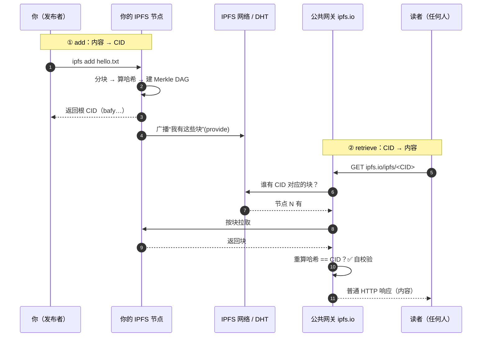

# 03 · 添加与获取文件（Add & Retrieve）

> IPFS 最基本的两个动作：`add`（把内容加入 IPFS，得到一个 CID）和 `cat/get`（只凭 CID 把内容取回来）。本模块把这条最短闭环跑通。

## 📖 知识讲解

### add：内容 → CID

把文件加入 IPFS 时发生了什么：

1. **分块（chunking）**：文件按默认 256 KiB 切成块（小文件就一块）。
2. **算哈希**：每块算 CID。
3. **建 DAG**：用 UnixFS 把块组织成 Merkle DAG，得到根 CID。
4. **存 + pin**：块存进本地节点的仓库（blockstore），并 pin 住（防被垃圾回收）。

命令行：

```bash
ipfs add hello.txt
# added bafybeih...（根 CID）  hello.txt
```

> ⚠️ `ipfs add` 只是把文件放进**你自己的节点**并 pin，**没有**上传到别的地方。别人能取到，前提是你的节点在线、或你把它 pin 到了 pinning 服务（05 模块）。

### retrieve：CID → 内容

拿到 CID 后取回内容有几条路：

- **本地节点**：`ipfs cat <CID>` / `ipfs get <CID>`。节点通过 DHT 找到「谁有这些块」，按块拉取并**边拉边校验哈希**。
- **公共网关（最省事）**：浏览器/任何 HTTP 客户端访问 `https://ipfs.io/ipfs/<CID>`，网关替你去 IPFS 网络取，再用普通 HTTP 返回给你。无需装任何东西（04 模块专讲网关）。

关键直觉：**取内容时你从不指定「哪台服务器」**，只报 CID，网络负责找到持有者。取回后本地重算哈希核对 CID，**自校验**保证内容没被篡改。

## 🔄 流程图 / 原理图

### add 与 retrieve 的完整闭环



## 💻 代码说明

`demo.js`（零依赖，用 Node 18+ 内置 `fetch` 与 `crypto`）：

1. **add 部分**：本地把一段内容算成 `CIDv1(raw)`（与 `ipfs add --cid-version=1 --raw-leaves` 一致），展示「内容 → CID」这一步不需要联网、结果确定；
2. **retrieve 部分**：拿一个官方文档常用的经典示例 CID，**依次尝试多个公共网关**取回内容，演示「只凭 CID、不指定服务器」就能拿到数据，以及网关会做哈希自校验。

## ▶️ 运行方式

```bash
cd 03-add-and-retrieve
node demo.js
```

会先打印本地算出的 CID，再从公共网关取回一份真实内容（会自动在多个网关间重试）。

想用真节点体验完整流程（可选，需安装 IPFS Kubo）：

```bash
ipfs init && ipfs daemon      # 启动本地节点
echo "hi ipfs" > hi.txt
ipfs add hi.txt               # 得到 CID
ipfs cat <CID>                # 取回
```

## ⚠️ 常见坑 / 安全提示

- **add ≠ 上传到云**：加进本地节点后，若节点离线且没 pin 到远端服务，别人可能取不到。要「别人也能长期取到」，用 pinning 服务（05）。
- **首次取内容可能很慢**：DHT 找提供者需要时间；用公共网关或把内容 pin 到有稳定节点的服务能显著加速（网关会缓存）。
- **别把敏感数据 add 进去**：一旦被别人取走/缓存，无法从全网撤回。敏感内容先加密。
- **CID 拿到但取不到 ≠ CID 错**：CID 只保证正确性，不保证可用性。

## 🔗 官方文档

- 添加文件到 IPFS：https://docs.ipfs.tech/how-to/add-files/
- 通过网关取内容：https://docs.ipfs.tech/how-to/retrieve-files/
- Kubo（Go 实现）命令行：https://docs.ipfs.tech/reference/kubo/cli/
- IPFS 工作原理：https://docs.ipfs.tech/concepts/how-ipfs-works/
