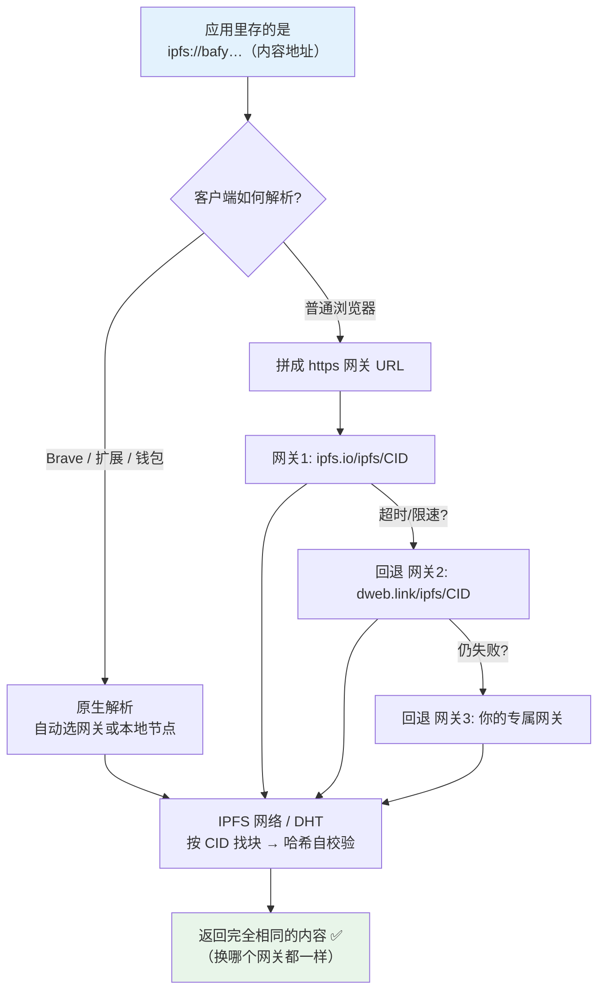

# 04 · 网关与 ipfs:// 协议（Gateways & the ipfs:// Protocol）

> 浏览器不懂 IPFS，只懂 HTTP。**网关（Gateway）** 就是「HTTP ↔ IPFS」的桥：你用普通 `https://` 访问它，它替你去 IPFS 网络按 CID 取内容再返回。本模块讲公共网关、子域名网关、`ipfs://` 原生协议、以及为什么别把某个网关地址写死。

## 📖 知识讲解

### 网关是什么

一次网关访问的链路：

```
你的浏览器 ──HTTP──> 网关(ipfs.io) ──IPFS/DHT──> 持有内容的节点
```

网关内部跑着一个 IPFS 节点，按 CID 取块、做哈希自校验，再用普通 HTTP 把内容吐给你。**免安装**是它最大的价值——任何 HTTP 客户端都能读 IPFS。

### 三种访问形式

| 形式 | 例子 | 特点 |
| --- | --- | --- |
| **Path 网关** | `https://ipfs.io/ipfs/<CID>` | 最通用；但所有 CID 共享同一个源(origin)，浏览器安全隔离弱。 |
| **子域名网关** | `https://<CIDv1>.ipfs.dweb.link` | 每个 CID 独立源，`localStorage`/cookie 天然隔离，更安全；**仅支持 CIDv1**（要全小写 base32）。 |
| **原生协议** | `ipfs://<CID>` | 最去中心化：不写死任何网关，由客户端（Brave 原生 / 浏览器扩展 / 钱包）决定怎么解析。**NFT/dApp 里应存这种。** |

### 公共网关 vs 自建网关

- **公共网关**（ipfs.io、dweb.link、cloudflare-ipfs.com、gateway.pinata.cloud…）：便利，但**不是承诺**——会限速、可能下线、有的已停止服务。适合演示、读取，**不适合作为生产唯一依赖**。
- **专属/自建网关**：Pinata、Filebase 等提供你专属的网关域名；也可自己用 Kubo 跑 `ipfs daemon` 开 `:8080` 网关，或用 rainbow/bifrost。生产建议：**用你能掌控的网关 + 客户端多网关回退**。

### 关键原则：内容地址与网关解耦

**永远不要把「某个网关的 https 地址」当成内容的永久地址存起来。** 因为：

```
❌ https://cloudflare-ipfs.com/ipfs/<CID>   ← 网关挂了/换了，链接就死
✅ ipfs://<CID>                              ← 只认内容，客户端自己选网关，永不失效
```

同一个 CID 能从**任何**网关取到**完全相同**的内容（内容寻址保证），所以「存 CID/ipfs://，展示时再拼网关」是正确姿势。`index.html` 就同时向多个网关请求同一 CID，让你看到「多源、可切换」。

## 🔄 流程图 / 原理图

### 一次网关请求的解析路径 + 客户端多网关回退



## 💻 代码说明

`index.html`：浏览器直接打开。输入一个 CID，**同时向 4 个公共网关发起请求**，实时显示每个网关的成功/失败与耗时。核心演示点：

- 同一 CID，多个网关都能取回**相同内容** → 内容寻址让来源可替换；
- 各网关速度/可用性不同 → 印证「生产要多网关回退，别写死一个」。

README 末尾也给出了 path / 子域名 / `ipfs://` 三种写法的对照。

## ▶️ 运行方式

```bash
open 04-gateways/index.html     # macOS，或直接双击
```

点「同时向所有网关请求」，观察各网关结果与耗时。可把 CID 换成你自己 pin 的内容试。

## ⚠️ 常见坑 / 安全提示

- **别把网关 URL 写进 NFT/合约/数据库当永久地址**：存 `ipfs://<CID>`，展示层再拼网关。历史上多个公共网关停服，写死者集体失效。
- **公共网关无 SLA**：会限速、可能对大文件超时。生产用专属网关或自建，并做多网关回退。
- **子域名网关只吃 CIDv1**：CIDv0（`Qm…`）会被转成 CIDv1；前端统一用 CIDv1 更省心。
- **网关会看到你请求了哪些 CID**：隐私敏感场景注意，网关运营者能记录访问日志。
- **网关不改变可用性本质**：内容没被任何节点 pin/提供，再多网关也取不到。

## 🔗 官方文档

- 网关概念：https://docs.ipfs.tech/concepts/ipfs-gateway/
- 网关类型（path / 子域名 / DNSLink）：https://docs.ipfs.tech/how-to/address-ipfs-on-web/
- 公共网关列表（社区维护）：https://ipfs.github.io/public-gateway-checker/
- 在 Web 上寻址 IPFS 内容：https://docs.ipfs.tech/how-to/websites-on-ipfs/
