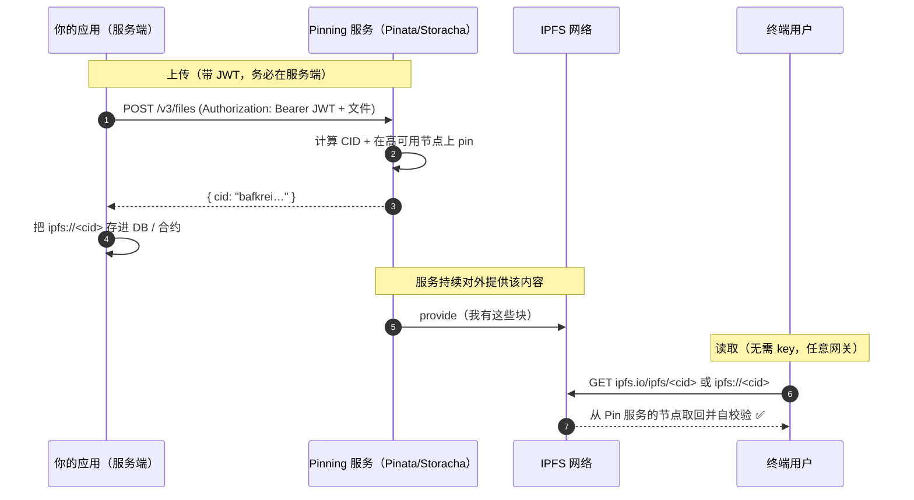

# 05 · Pinning 固定服务（Pinning Services）

> IPFS 上「内容能不能被持续访问」，取决于**是否有节点还留着它**。**Pin（固定）** 就是告诉节点「这份内容别删」。Pinning 服务（Pinata、Storacha 等）替你在稳定的在线节点上长期 pin，解决「上传后没人存、内容消失」的问题。

## 📖 知识讲解

### 为什么要 pin

IPFS 节点的本地仓库会**垃圾回收（GC）**：没被 pin 的块随时可能被清掉。所以：

- 你 `ipfs add` 的内容默认在**你自己节点**上被 pin，但你节点一关机/GC，别人就取不到；
- 只有**至少一个在线节点 pin 着**某 CID，全网才能持续取到它。

> 记住：**上传 ≠ 永久**。IPFS 只保证「拿到的一定是对的」，不保证「一直拿得到」。持久性 = 有节点持续 pin（本模块）+ 更强的可用 Filecoin 存储交易（08 模块）。

### Pinning 服务做什么

Pinning 服务运营着一批高可用节点，帮你：

1. **上传**：把文件传给它；
2. **pin**：在它的节点上固定住，保证长期在线可取；
3. **专属网关**：通常还送你一个专属网关域名，读取更快更稳。

主流选择：

| 服务 | 说明 |
| --- | --- |
| **Pinata** | 最流行，REST API + SDK，NFT/dApp 常用；有免费额度。当前上传端点 `https://uploads.pinata.cloud/v3/files`，JWT 认证。 |
| **Storacha** | web3.storage / nft.storage 的后继（w3up 协议，UCAN 授权），背靠 Filecoin。老的 `nft.storage` Classic 上传 API 已进入维护/受限，**新项目走 Storacha**。 |
| **Filebase** | S3 兼容接口，pin 到 IPFS + Filecoin。 |
| **自建** | 自己跑 Kubo 节点 `ipfs pin add <CID>`，或用 IPFS Cluster 做多节点冗余 pin。 |

### 认证与安全（重点）

Pinning 服务用 **API Key / JWT** 认证。**JWT 是机密**：

- **绝不**写进前端代码、源码、或提交进仓库（会被爬走盗刷额度）；
- 放**服务端**环境变量 / `.env`（并 `.gitignore`）；前端要上传就走你自己的后端中转，或用服务商提供的**受限、短期**上传凭证。

## 🔄 流程图 / 原理图

### 上传 + pin + 读取的全流程



## 💻 代码说明

`demo.js`（零依赖，用 Node 18+ 内置 `fetch` / `FormData` / `Blob`）：

- **默认干跑模式**：不填 key 也能运行，只打印将要发送的请求和等价 `curl`，让你看懂上传长什么样 —— 安全、可复现；
- **真上传模式**：设了环境变量 `PINATA_JWT` 才会真的调用 Pinata v3 端点上传并 pin，返回 `cid`；
- 文件末尾附了 **Pinata 官方 SDK** 与 **Storacha（w3up）** 的等价写法作参考。

所有 key 都用**环境变量占位**，代码里没有任何真实密钥。

## ▶️ 运行方式

干跑（推荐先跑这个，无需 key）：

```bash
cd 05-pinning-services
node demo.js
```

真实上传（自行到 https://app.pinata.cloud 申请 JWT）：

```bash
PINATA_JWT=<你的JWT> node demo.js
# 成功后用返回的 cid: https://ipfs.io/ipfs/<cid>
```

## ⚠️ 常见坑 / 安全提示

- **JWT/API Key 绝不进前端和仓库**：泄露即被盗刷。放服务端环境变量，前端上传走后端中转或短期受限凭证。
- **上传成功 ≠ 永久保存**：pin 依赖服务在线 + 你的付费额度。免费额度/账号到期后可能被 unpin。真正长期归档要配 Filecoin（08）。
- **取消 pin 不等于删除全网副本**：别人若也 pin/缓存了，你 unpin 也删不掉他们的副本。
- **上传前想清楚公开性**：公共 pin 的内容任何人可读，敏感数据先加密或用 private 网络。
- **API 会演进**：Pinata 从旧的 `pinFileToIPFS` 迁到了 v3 `uploads.pinata.cloud/v3/files`；nft.storage 迁到了 Storacha。用前对照最新官方文档。

## 🔗 官方文档

- IPFS Pinning 概念：https://docs.ipfs.tech/concepts/persistence/
- Pinning 服务与 API：https://docs.ipfs.tech/how-to/work-with-pinning-services/
- Pinata 快速上手：https://docs.pinata.cloud/quickstart
- Storacha（原 web3.storage）：https://docs.storacha.network/
- IPFS Cluster（自建多节点 pin）：https://ipfscluster.io/
