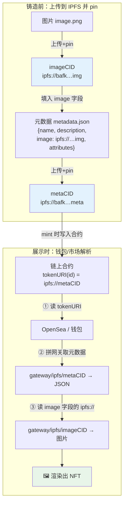

# 06 · NFT 元数据存 IPFS（NFT Metadata on IPFS）

> NFT 的图片和元数据如果存在中心化服务器，服务器一挂图就裂、内容还能被偷偷替换。把它们存 IPFS、链上只存 `ipfs://<CID>`，就能做到**去中心化 + 不可篡改 + 省 gas**。本模块把「图片 → 元数据 → tokenURI」三层用 IPFS 串起来。

## 📖 知识讲解

### NFT 的三层结构

一个标准 ERC-721 NFT 展示出来，背后是三层：

1. **合约里的 `tokenURI(tokenId)`**：链上只存一个**指针**，返回元数据地址（应为 `ipfs://<metaCID>`）。链上存全量数据太贵，只存短 CID 最省 gas。
2. **元数据 JSON（metadata）**：符合 ERC-721 Metadata / OpenSea 标准，含 `name`、`description`、`image`、`attributes` 等。存在 IPFS，地址即 `metaCID`。
3. **媒体文件（image 等）**：真正的图片/视频。也存 IPFS，元数据的 `image` 字段写 `ipfs://<imageCID>`。

### 为什么每层都用 `ipfs://` 而不是网关 https

**这是 NFT 最经典的坑。** 如果 `image` 写成 `https://某网关/ipfs/CID`：

- 该网关限速/下线/停服，**图片永久裂开**（历史上大量 NFT 因写死网关或中心化 URL 而「图没了」）；
- 中心化 URL 还能被替换内容，NFT 失去「不可篡改」的意义。

正确做法：**存 `ipfs://<CID>`**（内容地址），钱包/市场（OpenSea、Blur 等都支持）在展示时自己拼网关。内容地址永不失效，换任何网关取到的都是同一份。

### 内容变了 CID 就变 → 天然防篡改

元数据 JSON 改一个字节，`metaCID` 就完全变，于是 `tokenURI` 也得变。这意味着：一旦 mint 时把 `tokenURI` 固定成某个 CID，**元数据就被「钉死」了**，任何人都无法在不改变 CID 的情况下偷改内容——这正是 NFT「稀有度/属性可信」的基础。

> ⚠️ 反过来，如果你需要「可更新」的元数据（如游戏道具升级），要么每次更新换新 CID 并更新链上指针，要么用 IPNS 指针（07 模块）。但要清楚：可更新就意味着放弃了「永久钉死」的不可篡改性。

### 别忘了 pin

图片和元数据都必须被**持续 pin**（05 模块），否则节点 GC 后 NFT 就变成「有地址、取不到内容」。正经项目会把两者都 pin 到 Pinata/Storacha，重要资产再上 Filecoin（08）。

## 🔄 流程图 / 原理图

### NFT 元数据存储与解析全流程



## 💻 代码说明

`demo.js`（零依赖）完整走一遍：

1. 用一段假字节代表图片，算出 `imageCID`，构造 `image: "ipfs://<imageCID>"`；
2. 拼出符合 ERC-721 标准的 **元数据 JSON**（`name`/`description`/`image`/`attributes`）；
3. 对元数据算 `metaCID`，得到 `tokenURI = "ipfs://<metaCID>"`；
4. 打印展示用的网关 URL，以及对应的 **Solidity `tokenURI` 教学片段**（配合本合集 05-openzeppelin / 06-token-standards 模块）。

其中 CID 用与 `ipfs add --cid-version=1 --raw-leaves` 一致的算法本地算出，结果真实可对账。

## ▶️ 运行方式

```bash
cd 06-nft-metadata
node demo.js
```

会打印元数据 JSON、各层 CID、`tokenURI`，以及 Solidity 示意代码。

## ⚠️ 常见坑 / 安全提示

- **`image` 和 `tokenURI` 一律用 `ipfs://`，绝不写死网关 https**：否则网关一挂图永久裂。展示层再拼网关。
- **务必 pin 图片和元数据**：不 pin = 迟早取不到，NFT 变「空壳」。重要资产上 Filecoin 归档。
- **JSON 要稳定序列化**：字段顺序/空白变化会改变 CID。生成后就别再动，或明确走「换新 CID + 更新指针」流程。
- **合约里只存 CID/短字符串**：别把整段 JSON 上链，gas 会爆。
- **教学合约未经审计**：示例 Solidity 仅供学习，勿直接上主网。

## 🔗 官方文档

- 在 IPFS 上存 NFT 数据（最佳实践）：https://docs.ipfs.tech/how-to/mint-nfts-with-ipfs/
- ERC-721 标准（含 Metadata JSON Schema）：https://eips.ethereum.org/EIPS/eip-721
- OpenSea 元数据标准：https://docs.opensea.io/docs/metadata-standards
- 用 ipfs:// 在 Web 上寻址：https://docs.ipfs.tech/how-to/address-ipfs-on-web/
