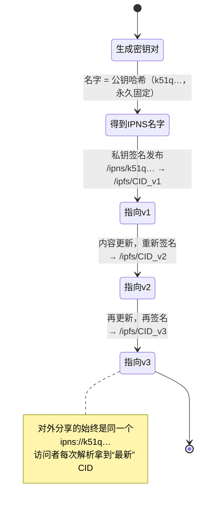

# 07 · IPNS 可变指针（IPNS — Mutable Pointers）

> 内容寻址是**不可变**的：内容一改，CID 就变。可有些东西需要「地址不变、内容能更新」（个人主页、可升级资料）。**IPNS（InterPlanetary Name System）** 用一对密钥生成一个**固定的名字**，你可以随时用私钥把它**重新指向**新的 CID —— 名字不变，目标可变。

## 📖 知识讲解

### 问题：CID 太「诚实」了

CID 的优点（内容变则地址变）在「需要更新」的场景反而成了负担：你每发一版博客，CID 都变，就得把新链接再发一遍给所有人。我们需要一个**稳定的别名**。

### IPNS 名字 = 公钥的哈希

IPNS 的做法：

1. 生成一对**密钥**（通常 ed25519）；
2. **IPNS 名字 = 公钥的哈希**（本质是一个 `libp2p-key` 类型的 CIDv1，base36 编码，形如 `k51q…`）。这个名字**永远固定**，因为公钥不变；
3. 你用**私钥签名**一条 **IPNS record**，内容是「这个名字当前指向 `/ipfs/<某CID>`」，并发布到网络（默认走 DHT）；
4. 别人拿 `/ipns/<你的名字>` 来解析，网络返回你签过名的记录，得到当前 CID；
5. 内容更新了？用私钥**重新签一条**指向新 CID 的记录发布即可 —— 名字不变。

### 自证明（self-certifying）

IPNS record 由私钥签名，**记录本身就带着验证所需的一切**：任何人都能用名字里的公钥验证「这条记录确实是名字主人签的」，无需任何中心化机构。这就是「自证明」。

### 类比 git

官方最爱的类比：

- **IPNS 名字 ≈ git 的 tag / 分支**（可移动的指针）；
- **CID ≈ git 的 commit 哈希**（固定的快照）。

### IPNS vs DNSLink

除了 IPNS，还能用 **DNSLink** 做可变地址：在域名的 DNS TXT 记录里写 `dnslink=/ipfs/<CID>`。对比：

| | IPNS | DNSLink |
| --- | --- | --- |
| 名字 | `k51q…`（公钥哈希，不好记） | `yoursite.com`（人类可读） |
| 更新 | 私钥签名发布，去中心化 | 改 DNS 记录，依赖 DNS（中心化） |
| 解析速度 | 较慢（DHT） | 快（DNS） |
| 组合 | 常用 DNSLink 指向一个 IPNS 名，兼得可读与去中心化 | |

### 代价：慢 & 需持续发布

IPNS 解析比直接取 CID 慢（要查 DHT）；record 有**有效期（默认约 24-48h）和 TTL**，过期需要**重新发布**才能保持解析。长期在线通常要节点/服务帮你定期 republish。

## 🔄 流程图 / 原理图

### 固定名字，指向随时间变化的 CID



## 💻 代码说明

`demo.js`（零依赖）：

1. 用 Node 内置 `crypto` 生成**真实的 ed25519 密钥对**；
2. 严格按 libp2p 规范，从公钥算出**真正的 IPNS 名字**（`PublicKey` protobuf → identity multihash → CIDv1(`libp2p-key`) → base36），输出形如 `k51q…`（与 Kubo 生成的一致）；
3. 模拟「同一个名字先后指向 v1/v2/v3 三个不同 CID」，直观呈现「名字不变、目标可变」；
4. 给出 `ipfs name publish` / `ipfs name resolve` 的真实命令行等价操作。

> 运行输出里的 IPNS 名字每次不同，因为每次都新生成密钥对——这正好说明「名字由密钥决定」。

## ▶️ 运行方式

```bash
cd 07-ipns-mutable
node demo.js
```

想在真节点体验（可选，需 IPFS Kubo）：

```bash
echo "v1" > site.txt && ipfs add -Q site.txt          # 得到 CID_v1
ipfs name publish /ipfs/<CID_v1>                       # 发布 IPNS，打印你的 k51q… 名字
ipfs name resolve /ipns/<你的名字>                      # 解析出当前 CID
# 更新内容后再 add、再 publish，名字不变、指向已更新
```

## ⚠️ 常见坑 / 安全提示

- **私钥就是控制权**：谁拿到 IPNS 私钥，谁就能把你的名字指向任意内容。**私钥务必安全保存**，绝不进仓库。
- **解析慢、需 republish**：IPNS 记录有有效期，过期不再发布就解析不到；对时延敏感的场景要权衡，或用节点/服务保活。
- **可变 = 放弃不可篡改**：IPNS 指向能被（私钥持有者）改，所以别用 IPNS 地址去做「需要永久钉死」的事（如 NFT 元数据一般直接钉 CID，见 06）。
- **别把 IPNS 当高频数据库**：它是「偶尔更新的指针」，不是实时可写存储。

## 🔗 官方文档

- IPNS 概念：https://docs.ipfs.tech/concepts/ipns/
- 发布 IPNS 名字：https://docs.ipfs.tech/how-to/publish-ipns/
- DNSLink：https://docs.ipfs.tech/concepts/dnslink/
- IPNS 规范（libp2p key / record）：https://specs.ipfs.tech/ipns/ipns-record/
