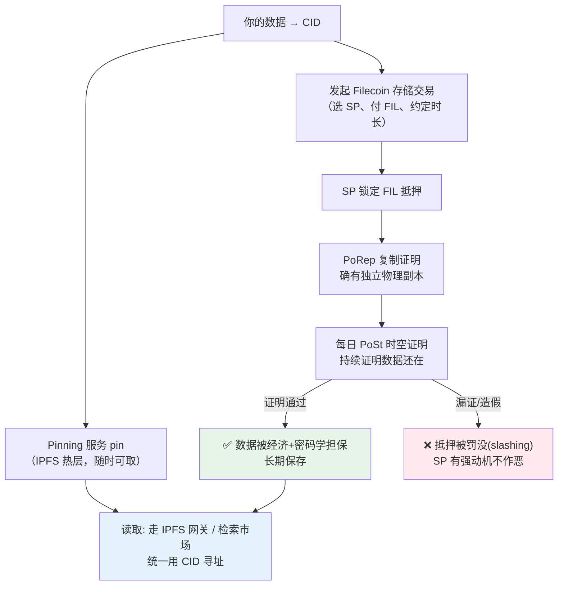

# 08 · Filecoin 与去中心化 Web（Filecoin & the Decentralized Web）

> IPFS 解决了「内容怎么寻址、怎么分发」，却没解决「谁出钱保证它长期不丢」。**Filecoin** 在 IPFS 之上加了一层**经济激励**：客户付费，存储提供者用密码学证明「我确实一直存着你的数据」，存不好就**没收抵押**。本模块讲 Filecoin 与整个去中心化 Web 生态如何拼在一起。

## 📖 知识讲解

### IPFS 的短板：没有激励

IPFS 里，内容能被持续访问的前提是「有节点自愿 pin」。但**自愿**不可靠：节点主人可能关机、删数据、失去兴趣。于是内容就悄悄消失了（link rot）。IPFS 本身没有任何机制**逼**或**奖励**谁去长期保存你的数据。

### Filecoin 的方案：把存储变成有抵押的市场

Filecoin 是一条**区块链 + 去中心化存储市场**：

- **客户（client）** 付 FIL，向**存储提供者（Storage Provider, SP）** 购买存储；
- SP 必须**锁定 FIL 抵押**；
- SP 每天要提交**密码学证明**，证明数据还在。**漏证 / 造假 → 抵押被罚没（slashing）**。

这就把「你会不会一直存着我的数据」从「相信人品」变成了「相信经济激励 + 密码学」。存储的可得性与定价由开放市场决定，**不受任何单一实体控制**。互联网档案馆（Internet Archive）、Shoah 基金会等已用它做归档。

### 两种关键证明

| 证明 | 全称 | 作用 |
| --- | --- | --- |
| **PoRep** | Proof-of-Replication 复制证明 | 存入时证明 SP 确实为你的数据生成了**独立物理副本**，不是假装存了 / 和别人共用一份。 |
| **PoSt** | Proof-of-Spacetime 时空证明 | **持续、每天**证明数据一直在。这是「长期不丢」的核心保障。 |

### 和 IPFS 的关系：互补，不是替代

- **多数 Filecoin 节点同时是 IPFS 节点**，都用 **CID** 寻址；
- **IPFS 负责「找到并快速取内容」**（热数据、P2P 分发、网关）；
- **Filecoin 负责「用经济手段保证内容长期存在」**（冷数据、归档、担保）；
- 常见搭配：**热数据 pin 在 IPFS（Pinata/Storacha）随时可取，重要/冷数据落进 Filecoin 存储交易长期兜底。**

### 去中心化 Web（dWeb）全景

把本合集学过的东西串起来，一个去中心化应用的存储层长这样：

| 层 | 技术 | 作用 |
| --- | --- | --- |
| 寻址 / 分发 | **IPFS**（CID） | 内容寻址、P2P 取内容（01-04） |
| 可变命名 | **IPNS / DNSLink** | 固定名字指向可更新内容（07） |
| 持久化 pin | **Pinata / Storacha / Filebase** | 高可用节点长期 pin（05） |
| 持久化激励 | **Filecoin** | 付费存储 + 证明 + 罚没，长期不丢（本模块） |
| 身份 / 资产 | 以太坊等公链 | 链上只存 `ipfs://CID`，数据在 IPFS/Filecoin（06） |

> 上链坡道（on-ramp）：像 **Storacha**（web3.storage 后继）、**Filebase** 这类服务，用一个简单 API 就能把文件**同时 pin 到 IPFS 并存进 Filecoin**，省去自己和 SP 谈交易的复杂度。

## 🔄 流程图 / 原理图

### 数据从上传到「被经济担保长期保存」



## 💻 代码说明

本模块是**生态概念讲解**，配套 `index.html` 是一张**静态图文页**（双击即开，无需联网/安装）：

- IPFS vs Filecoin 的分工对照表；
- Filecoin 四要素卡片（存储交易 / PoRep / PoSt / 检索）；
- 去中心化 Web 分层拼图；
- 把 05/06/08 串起来的「热数据 pin + 冷数据 Filecoin」典型实践。

（真正发起 Filecoin 存储交易涉及钱包、FIL、选 SP 或调用 Storacha/Filebase API，成本与门槛较高，超出「浏览器免安装 demo」范围，故本模块以生态讲解为主，动手部分回到 05 模块的 pinning。）

## ▶️ 运行方式

```bash
open 08-filecoin-and-web/index.html     # macOS，或直接双击
```

想动手把数据真正推进 Filecoin：先用 05 模块把文件 pin 到 Pinata，再研究 Storacha / Filebase 这类「同时 pin IPFS + 存 Filecoin」的上链坡道服务。

## ⚠️ 常见坑 / 安全提示

- **Filecoin 上交易 = 花真钱（FIL）**：学习别乱发主网交易；先用免费的 pinning 服务和测试环境理解流程。
- **「存了 Filecoin」也要看检索**：数据长期保存不代表随时秒取；热访问仍建议配 IPFS pin / 网关缓存。
- **别混淆 IPFS 与 Filecoin**：IPFS 免费、无激励、可能丢；Filecoin 付费、有激励、长期担保。生产按冷热分层用。
- **私钥/钱包安全**：涉及 FIL 与合约（FVM）时，遵循本合集安全底线——测试优先、私钥绝不进仓库。

## 🔗 官方文档

- Filecoin 是什么：https://docs.filecoin.io/basics/what-is-filecoin/
- Filecoin 与 IPFS 的关系：https://docs.filecoin.io/basics/what-is-filecoin/storage-model
- 存储证明（PoRep / PoSt）：https://docs.filecoin.io/basics/the-blockchain/proofs
- Storacha（上链坡道）：https://docs.storacha.network/
- IPFS 持久性与 Filecoin：https://docs.ipfs.tech/concepts/persistence/
