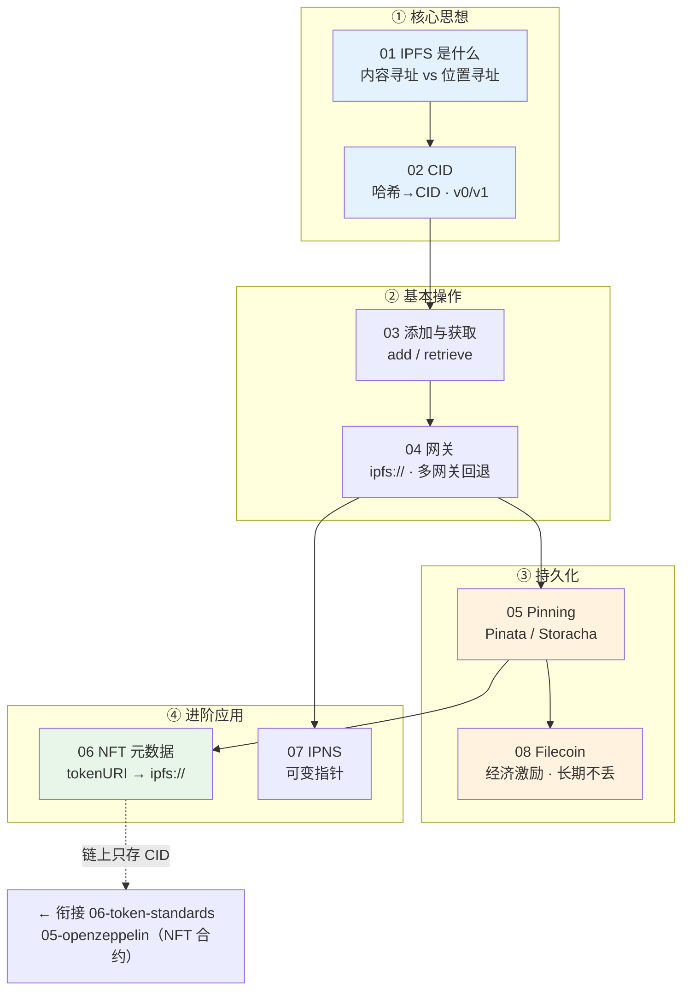

# 11 · IPFS 去中心化存储（IPFS Storage）

> Web3 学习合集第 11 个工程。系统讲清 **IPFS（星际文件系统）**：从「内容寻址」的核心思想，到 CID、网关、Pinning、NFT 元数据、IPNS，再到 Filecoin 持久化与去中心化 Web 生态。全部模块**浏览器免安装** 或 **`node demo.js` 零依赖**即可运行，用**公共网关**演示读取，上传类用 **Pinata/Storacha** 占位 key 示例。

## 🌐 IPFS 是什么（30 秒版）

传统 Web 用**位置寻址**：URL 指向「哪台服务器」，服务器挂了链接就失效，内容还能被偷偷替换。IPFS 用**内容寻址**：每份内容按加密哈希算出一个 **CID**，地址即内容指纹——

- **自校验**：拿到数据重算哈希，篡改一个字节都会被发现；
- **多源抗单点**：任何持有该内容的节点都能提供它，不依赖某台服务器；
- **天然去重**：相同内容全网只有一个 CID。

IPFS 不是区块链、默认不加密、也不保证永久（要靠 pin / Filecoin）。它常和以太坊搭配：**链上只存 `ipfs://CID`，大数据（NFT 图片、元数据、前端）放 IPFS**。

## 📚 模块索引

| # | 模块 | 你会学到 | Demo | 运行 |
| --- | --- | --- | --- | --- |
| 01 | [what-is-ipfs](./01-what-is-ipfs/) | IPFS 是什么 · **内容寻址 vs 位置寻址（配对比图）** | `index.html` | 浏览器打开 |
| 02 | [cid](./02-cid/) | CID 内容标识符 · 哈希如何生成 · **CIDv0 vs v1** | `demo.js` | `node demo.js` |
| 03 | [add-and-retrieve](./03-add-and-retrieve/) | 添加/获取文件 · 通过网关访问 | `demo.js` | `node demo.js` |
| 04 | [gateways](./04-gateways/) | 公共/子域名网关 · `ipfs://` 协议 · 自建网关 | `index.html` | 浏览器打开 |
| 05 | [pinning-services](./05-pinning-services/) | 为什么要 pin · **Pinata / Storacha 上传示例** | `demo.js` | `node demo.js` |
| 06 | [nft-metadata](./06-nft-metadata/) | NFT 元数据存 IPFS · tokenURI 指向 `ipfs://`（**配流程图**） | `demo.js` | `node demo.js` |
| 07 | [ipns-mutable](./07-ipns-mutable/) | IPNS 可变指针 · 固定名字指向可变 CID | `demo.js` | `node demo.js` |
| 08 | [filecoin-and-web](./08-filecoin-and-web/) | Filecoin 持久化 · 去中心化 Web 生态 | `index.html` | 浏览器打开 |

## 🗺️ 学习路线



**推荐顺序**：01 → 02 打牢「内容寻址 + CID」的地基 → 03 → 04 跑通「加内容 / 取内容 / 网关」 → 05（+08）解决「怎么让内容长期活着」 → 06、07 落到「NFT 元数据 / 可变指针」两个高频应用。

## ▶️ 运行说明

**环境**：Node 18+（模块 02/03/05/06/07 的 `demo.js` 均**零第三方依赖**，只用内置 `crypto`/`fetch`）；浏览器（模块 01/04/08 的 `index.html` 双击即开）。

```bash
# Node demo（示例）
cd 11-ipfs-storage/02-cid && node demo.js
cd ../03-add-and-retrieve && node demo.js
cd ../05-pinning-services && node demo.js          # 干跑，无需 key
cd ../06-nft-metadata && node demo.js
cd ../07-ipns-mutable && node demo.js

# 浏览器 demo（macOS，或直接双击 html）
open 01-what-is-ipfs/index.html
open 04-gateways/index.html
open 08-filecoin-and-web/index.html
```

**读取演示**：全部用**公共网关**（ipfs.io / dweb.link / cloudflare-ipfs.com / gateway.pinata.cloud），无需装节点。示例 CID 用 IPFS 官方文档常用的经典 `QmXoypizjW3WknFiJnKLwHCnL72vedxjQkDDP1mXWo6uco`。

**上传演示**：05 模块 Pinata 示例用**环境变量占位** `PINATA_JWT`，需自行到 [app.pinata.cloud](https://app.pinata.cloud) 申请；默认干跑模式不填 key 也能看懂流程。

## ⚠️ 安全底线（全工程强制）

- **IPFS 默认公开、默认不加密**：绝不把私钥、助记词、隐私数据直接上 IPFS；要保密先自行加密。
- **API Key / JWT 绝不进代码和仓库**：用环境变量 / `.env`（并 `.gitignore`）；前端上传走后端中转或短期受限凭证。
- **上传即不可撤回地公开哈希**：内容被别人 pin/缓存后无法从全网删除，发布前想清楚。
- **CID 保证正确、不保证可得**：可用性靠持续 pin（05）/ Filecoin（08）。
- **NFT 存 `ipfs://CID`，别写死网关 https**：否则网关下线图永久裂（06）。

## 🔗 官方文档

- IPFS 文档：https://docs.ipfs.tech/
- Multiformats（CID/multihash）：https://multiformats.io/ ｜ CID 检查器：https://cid.ipfs.tech/
- Pinata：https://docs.pinata.cloud/ ｜ Storacha：https://docs.storacha.network/
- Filecoin：https://docs.filecoin.io/
