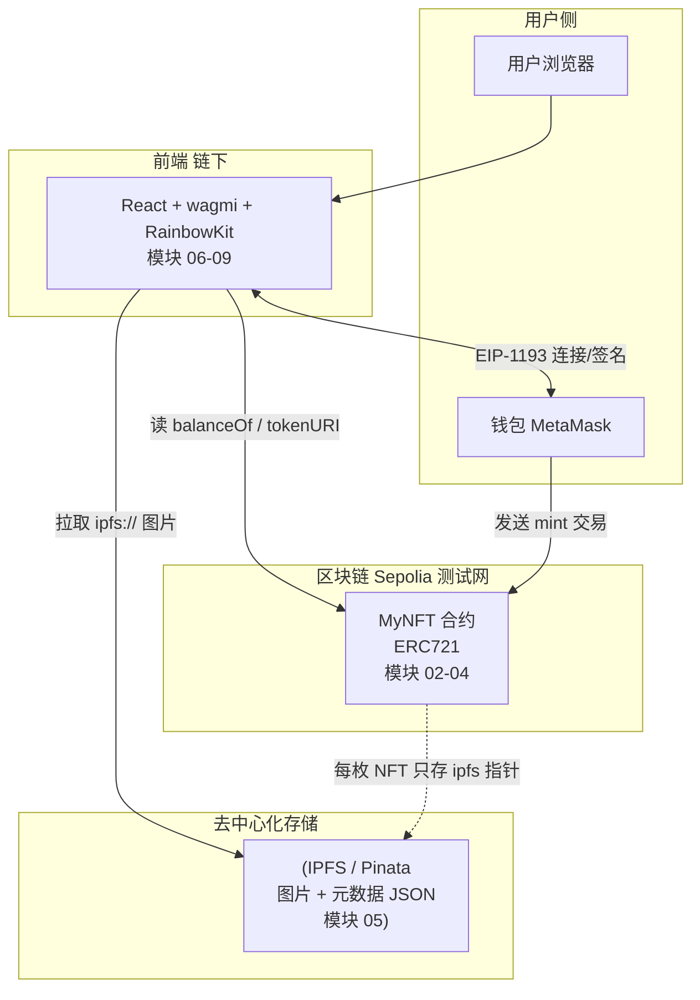
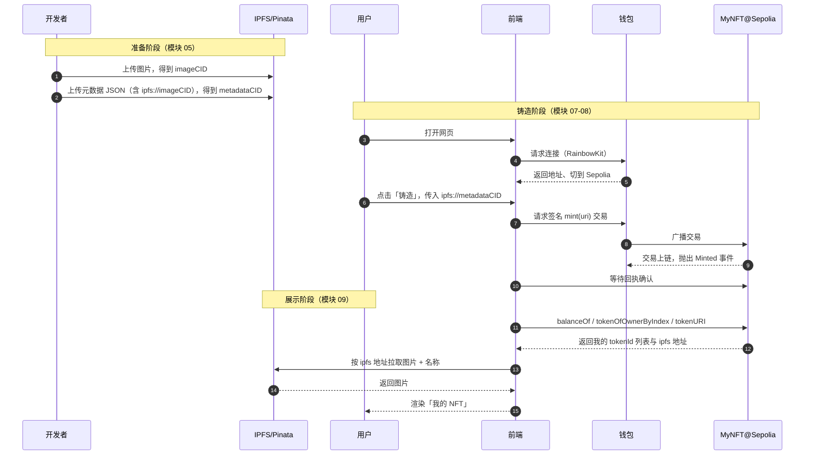

# 01 · 项目整体架构（Project Architecture）

> 一句话：在动手写第一行代码前，先建立「一枚 NFT 从图片到出现在你钱包里，中间到底经过了哪些系统」的整体地图，看清合约、前端、IPFS、测试网四者如何协作。

## 📖 知识讲解

我们要做的是一个**完整的 NFT 铸造 dApp**：用户打开网页 → 连接钱包 → 点击「铸造」→ 一枚绑定了 IPFS 图片的 NFT 就进了他的钱包，并能在页面上看到。麻雀虽小，五脏俱全，它把前 11 个工程的知识点串成一条完整的生产级链路。

### 四个组成部分

| 部分 | 技术栈 | 职责 | 对应模块 |
| --- | --- | --- | --- |
| **智能合约（链上）** | Solidity 0.8.x + OpenZeppelin ERC721 | NFT 的「真理之源」：记录谁拥有哪枚、每枚指向哪份元数据 | 02、03、04 |
| **去中心化存储** | IPFS（Pinata 固定） | 存 NFT 的图片与元数据 JSON（链上只存一个 ipfs:// 指针，因为链上存储极贵） | 05 |
| **前端（链下）** | Vite + React + wagmi v2 + RainbowKit | 用户界面：连钱包、发起铸造交易、读取并展示 NFT | 06、07、08、09 |
| **测试网络** | Sepolia 测试网 + 水龙头测试币 | 免费、安全地跑真实链上流程，绝不碰主网真钱 | 全程 |

### 关键设计：为什么图片不上链？

以太坊上每存 1 KB 数据要花费大量 Gas，一张图片存上链贵到离谱。业界通行做法是**链下存内容、链上存指针**：

1. 图片和元数据 JSON 放到 **IPFS**（内容寻址，改一个字节地址就变，天然防篡改）。
2. 合约里每枚 NFT 只存一个短短的 `tokenURI`，形如 `ipfs://<CID>`。
3. 前端/钱包/OpenSea 拿到 `tokenURI` 后，自己去 IPFS 把图片取回来渲染。

这就是 NFT「链上确权 + 链下存内容」的经典架构。

## 🔄 整体架构图

系统四大部分与它们之间的数据流：

## 💻 代码说明

本模块**不含代码**，是全项目的「说明书 / 地图」。后续每个模块只聚焦一步，建议对照本模块的模块索引表（见工程根 `README.md`）按顺序推进：

先把合约写好测好部署好（02→03→04），再准备好 NFT 素材上链存储（05），最后搭前端把它们连起来（06→07→08→09），收尾做部署与扩展（10）。

## 🔄 端到端数据流（一次成功铸造的全过程）

## ▶️ 运行方式

本模块无需运行。请先通读本文件与工程根 `README.md` 的「完整运行说明」，准备好三样东西再开始：

1. 一个**测试专用**的 MetaMask 钱包（切换到 Sepolia 网络）。
2. 一点 Sepolia 测试 ETH（水龙头见根 README）。
3. Node.js（合约端 18+，Hardhat 3 需 22+）。

## ⚠️ 常见坑 / 安全提示

- **全程只用 Sepolia 测试网**，绝不部署到主网、绝不使用真实资产。
- **私钥 / API Key / Pinata JWT 一律走 `.env`** 并已 gitignore，绝不写进代码或截图外发。
- 本项目所有合约标注「教学用途，未经审计，勿直接上主网」。
- 架构上要记住：**链上是真理之源，前端只是「读链 + 发交易」的展示层**；前端被篡改也改不了链上所有权。

## 🔗 官方文档

- 以太坊官方 · dApp 介绍：https://ethereum.org/zh/developers/docs/dapps/
- 以太坊官方 · NFT：https://ethereum.org/zh/nft/
- OpenZeppelin ERC721：https://docs.openzeppelin.com/contracts/5.x/erc721
- wagmi 文档：https://wagmi.sh/
- IPFS 文档：https://docs.ipfs.tech/
