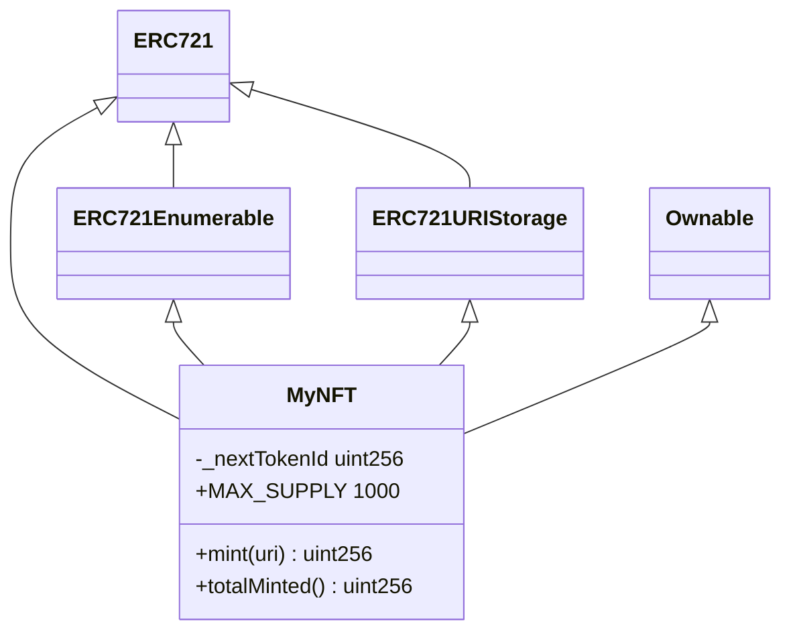
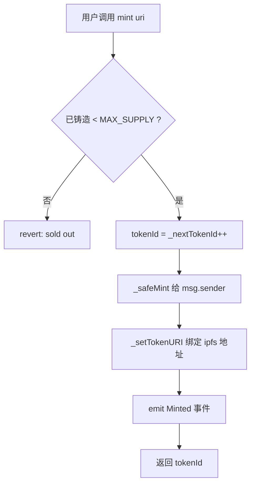

# 02 · 编写 NFT 合约（NFT Contract with OpenZeppelin ERC721）

> 一句话：用 OpenZeppelin v5 的 ERC721 积木，组合出一个「任何人都能给自己铸造、每枚绑定 IPFS 元数据、可枚举查询」的 NFT 合约 `MyNFT`。

## 📖 知识讲解

NFT（Non-Fungible Token，非同质化代币）遵循 **EIP-721** 标准：每一枚都有独一无二的 `tokenId`，可单独拥有、转让。我们不从零手写（那容易出安全漏洞），而是**继承经过实战与审计的 OpenZeppelin 合约**，只在上面加自己的业务逻辑。

### 四块积木怎么拼

```solidity
contract MyNFT is ERC721, ERC721Enumerable, ERC721URIStorage, Ownable
```

| 积木 | 给了我们什么 |
| --- | --- |
| `ERC721` | NFT 基础：`ownerOf` / `balanceOf` / `transferFrom` / `approve` + 所有权与授权逻辑 |
| `ERC721Enumerable` | `totalSupply` / `tokenOfOwnerByIndex`：链上「按序号列出某地址持有的全部 NFT」——模块 09 前端展示的基础 |
| `ERC721URIStorage` | 让**每枚 NFT 单独存一条 `tokenURI`**（指向 IPFS 元数据）；不用它则只能所有 NFT 共用一个 baseURI |
| `Ownable` | 访问控制：给合约一个 `owner`，可用 `onlyOwner` 保护管理函数 |

### 三个 v5 关键点（和老教程不一样，别踩坑）

1. **`Ownable` 构造函数必须显式传 `initialOwner`**：v5 起不再默认取 `msg.sender`，写成 `Ownable(initialOwner)`。
2. **不再有 `Counters` 库**：v5 移除了它，直接用一个 `uint256 _nextTokenId` 自增即可。
3. **多继承要写 override 模板**：因为 `_update`、`tokenURI`、`supportsInterface` 等在多个父合约里都有实现，编译器强制你用 `override(...)` 指明并 `super` 串联。这几段照 OpenZeppelin 合约向导抄即可（代码里已给全）。

### 为什么用 `_safeMint` 而不是 `_mint`

`_safeMint` 在接收方是合约时，会检查它是否实现了 `onERC721Received`，防止 NFT 被打进一个「不会处理 NFT 的合约」而**永久锁死**。铸给普通钱包地址两者等价，但安全起见统一用 `_safeMint`。

## 🔄 合约继承与铸造流程图

继承关系：



`mint()` 内部发生了什么：



## 💻 代码说明

见 `MyNFT.sol`（详细中文注释）。核心是自定义的公开 `mint(string uri)`：任何钱包都能给自己铸造一枚，并把该枚绑定到传入的 IPFS 元数据地址。附带 `MAX_SUPPLY = 1000` 供应量上限、`totalMinted()` 便于前端显示进度、`Minted` 事件便于索引。

## ▶️ 运行方式

本模块只是**写合约**，两种验证方式：

- **最快（推荐先做）**：复制 `MyNFT.sol` 到 [Remix](https://remix.ethereum.org) → 在 `.deps` 里 Remix 会自动拉 OpenZeppelin → 编译（选 0.8.24）→ 用「Remix VM」部署，构造函数 `initialOwner` 填你自己的地址 → 调用 `mint("ipfs://test")` 试铸。
- **工程化**：进入模块 03 的 Hardhat 工程 `npm install && npx hardhat compile`，合约已放在其 `contracts/` 下。

## ⚠️ 常见坑 / 安全提示

- **忘了给 `Ownable` 传 `initialOwner`** → v5 直接编译报错，务必写 `Ownable(initialOwner)`。
- **漏写 override 模板** → 多继承编译不过，把代码末尾那 4 个 override 函数照抄齐全。
- 公开 `mint` 没有收费/白名单，任何人可无限（在 MAX_SUPPLY 内）铸造——**这是教学简化**；真实项目常加铸造价格、每人限量、白名单签名等。
- 教学用途，未经审计，**只上 Sepolia，勿上主网**。

## 🔗 官方文档

- EIP-721 标准：https://eips.ethereum.org/EIPS/eip-721
- OpenZeppelin ERC721：https://docs.openzeppelin.com/contracts/5.x/erc721
- OpenZeppelin 合约向导（可视化生成同款代码）：https://wizard.openzeppelin.com/
- OpenZeppelin Ownable：https://docs.openzeppelin.com/contracts/5.x/api/access#Ownable
