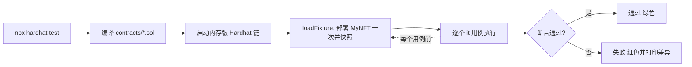

# 03 · 给合约写测试（Hardhat Test）

> 一句话：合约一旦上链就改不了，任何 bug 都可能造成资产损失，所以部署前必须用 Hardhat 把每个函数、边界、权限都自动化测一遍。

## 📖 知识讲解

这是一个**完整可运行的 Hardhat 工程**（模块 03 和 04 共用它）：

```
03-hardhat-test/
├── contracts/MyNFT.sol      ← 待测合约（来自模块 02）
├── test/MyNFT.test.js       ← 单元测试
├── hardhat.config.js        ← 编译器 / 网络 / 验证配置
├── package.json
└── scripts/deploy.js        ← 部署脚本（模块 04 加入）
```

### 测试栈：Hardhat + Mocha + Chai + ethers v6

`@nomicfoundation/hardhat-toolbox` 一次性装齐了测试要用的一切：

- **Mocha**：`describe` / `it` 组织测试用例。
- **Chai**：`expect(...).to.equal(...)` 做断言，还有 hardhat 扩展的 `.to.emit`（断言事件）、`.to.be.reverted`（断言交易回滚）。
- **ethers v6**：`getSigners`（拿测试账户）、`getContractFactory` / `deploy`（部署）、`connect(signer)`（切换 `msg.sender`）。
- **network-helpers 的 `loadFixture`**：只部署一次并打快照，之后每个用例秒回滚到干净状态，又快又互不干扰。

### 关于 Hardhat 版本

本项目用**稳定成熟的 Hardhat 2 + hardhat-toolbox**（内置 ethers v6 + mocha + chai + hardhat-verify），文档最全、初学者示例最多，与本学习合集其它工程一致（ethers 统一用 v6）。

> 📌 新动态：**Hardhat 3 已发布**，默认改用 viem + Node 内置 `node:test` 测试运行器 + Hardhat Ignition 部署，并要求 Node 22.13+。思路完全一致（编译→测试→部署→验证），学完本模块再迁移毫无压力。官方入门见文末链接。

## 🔄 测试执行流程图



## 💻 代码说明

见 `test/MyNFT.test.js`，覆盖了：

- **部署**：名称/符号、owner 被设为部署者、初始铸造量为 0。
- **铸造**：任意账户能给自己铸造、余额与 `ownerOf` 正确、`tokenURI` 绑定正确、`tokenId` 从 0 自增、抛出 `Minted` 与标准 `Transfer` 事件（`from = 零地址`）。
- **可枚举**：`tokenOfOwnerByIndex` 能列出某地址持有的全部 tokenId（模块 09 的基础）。
- **接口声明**：`supportsInterface` 正确声明 ERC721 / Metadata / Enumerable。
- **转账与权限**：持有者能转让；未授权者转账会 `revert`。

关键技巧：`nft.connect(alice).mint(...)` 用 `connect` 切换调用者身份，从而测试「不同用户」的行为与权限。

## ▶️ 运行方式

```bash
cd 03-hardhat-test
npm install          # 安装 hardhat + toolbox + openzeppelin
npx hardhat compile  # 编译合约
npx hardhat test     # 跑测试，应全部通过（绿色）
```

跑测试**不需要**任何测试网、私钥或测试币——它在本地内存链上运行，完全离线、免费、秒级。

## ⚠️ 常见坑 / 安全提示

- **Solidity 版本不匹配**：`hardhat.config.js` 里的 `solidity` 版本必须 ≥ 合约 `pragma`（这里 0.8.24），否则编译报错。
- **ethers v6 用 BigInt**：数量断言要用 `1n`、`0n`（BigInt 字面量），别用普通数字比较大数。
- **忘了 `await`**：几乎所有链上调用都是异步的，漏 `await` 会得到 Promise 而非结果。
- 测试通过 ≠ 绝对安全，但**没有测试的合约绝不该部署**。真实项目还应做覆盖率、fuzz、乃至第三方审计。

## 🔗 官方文档

- Hardhat 测试合约：https://hardhat.org/hardhat-runner/docs/guides/test-contracts
- Hardhat 3 入门（新版）：https://hardhat.org/docs/getting-started
- Chai 匹配器（hardhat-chai-matchers）：https://hardhat.org/hardhat-chai-matchers/docs/overview
- ethers v6 文档：https://docs.ethers.org/v6/
