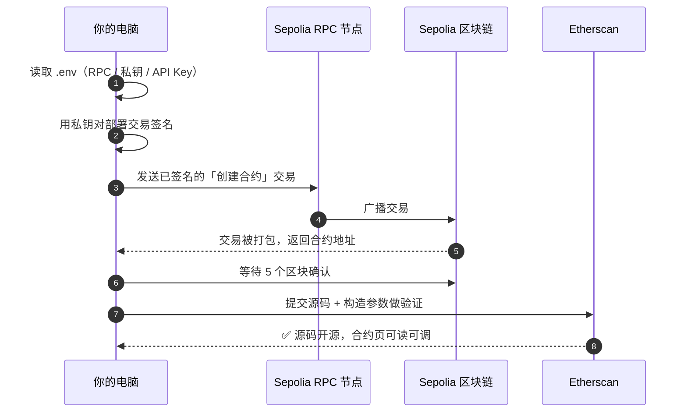

# 04 · 部署到 Sepolia 并验证（Deploy to Sepolia & Verify）

> 一句话：把测试通过的 `MyNFT` 合约发布到 Sepolia 公共测试网，拿到一个真实合约地址，并把源码在 Etherscan 开源验证，供任何人核对。

## 📖 知识讲解

模块 03 的测试跑在「本地内存链」上，一关电脑就没了。要让前端和别人的钱包能真正访问，必须部署到一条**公共链**。我们选 **Sepolia 测试网**：环境和主网一致，但用的是免费的测试 ETH，安全无成本。

> 本模块的 `scripts/deploy.js` / `.env.example` / `.gitignore` 属于**模块 03 那个 Hardhat 工程**的一部分。实际操作时把 `deploy.js` 放到 03 工程的 `scripts/` 下即可（03 与 04 共用同一个工程与 `hardhat.config.js`）。

### 部署需要三样东西（都放进 `.env`）

| 变量 | 是什么 | 从哪来 |
| --- | --- | --- |
| `SEPOLIA_RPC_URL` | 连上 Sepolia 的节点地址 | [Alchemy](https://alchemy.com) / [Infura](https://infura.io) 免费申请 |
| `PRIVATE_KEY` | 付 Gas 的账户私钥 | 你的**测试专用**钱包，需先领测试 ETH |
| `ETHERSCAN_API_KEY` | 做源码验证 | [etherscan.io/myapikey](https://etherscan.io/myapikey) 免费申请 |

### 什么是「合约验证」

部署上链的是**字节码**（人看不懂）。验证 = 把 Solidity 源码提交给 Etherscan，它重新编译并比对字节码一致后，就在区块浏览器上公开源码。好处：任何人都能读你的合约、在 Etherscan 网页上直接调用，也是 NFT 市场信任的前提。构造参数（这里的 `initialOwner`）必须和部署时**完全一致**，否则验证失败。

## 🔄 部署流程图



## 💻 代码说明

见 `scripts/deploy.js`：

1. `getSigners()` 取 `.env` 私钥对应的部署账户，并打印其余额（提醒你有没有测试币）。
2. `getContractFactory("MyNFT")` → `deploy(deployer.address)`：注意把 `initialOwner` 传成部署者自己。
3. `waitForDeployment()` 等待上链，拿到合约地址。
4. 若在 sepolia 且配了 API Key，等 5 个区块后自动 `verify:verify` 验证。
5. 最后打印出要填进前端（模块 06）的合约地址。

`hardhat.config.js`（在模块 03）里已配好 `sepolia` 网络（`url` + `accounts` + `chainId: 11155111`）和 `etherscan.apiKey`，且**私钥只从环境变量读，绝不硬编码**。

## ▶️ 运行方式

```bash
# 在模块 03 的 Hardhat 工程目录里（已把 deploy.js 放进 scripts/）
cp 04-deploy-sepolia/.env.example .env    # 然后填入你自己的三个值
# 确保 .env 里的钱包地址已从水龙头领到 Sepolia 测试 ETH（见根 README）

npx hardhat run scripts/deploy.js --network sepolia
```

成功后终端会打印合约地址，例如 `✅ MyNFT 已部署到: 0xabc...`，到 `https://sepolia.etherscan.io/address/0xabc...` 就能看到你的合约。**把这个地址记下来，模块 06 前端要用。**

单独验证（若部署时没自动验证）：

```bash
npx hardhat verify --network sepolia <合约地址> <部署者地址>
```

## ⚠️ 常见坑 / 安全提示

- **`.env` 绝不提交**：已在 `.gitignore` 中；私钥泄露 = 钱包被盗。建议用**只放少量测试币的小号钱包**。
- **余额不足**：没有 Sepolia ETH 无法付 Gas，先去水龙头领（根 README 有列表）。
- **验证时构造参数写错**：`constructorArguments` / 命令行参数必须与部署时一致（这里是部署者地址）。
- **RPC 限流**：免费公共 RPC 可能不稳，建议用自己的 Alchemy/Infura 地址。
- 教学合约，**只上 Sepolia，勿上主网**。

## 🔗 官方文档

- Hardhat 部署（Ignition）：https://hardhat.org/ignition/docs/getting-started
- hardhat-verify（Etherscan 验证）：https://hardhat.org/hardhat-runner/plugins/nomicfoundation-hardhat-verify
- Sepolia 测试网信息：https://ethereum.org/zh/developers/docs/networks/#sepolia
- Alchemy 免费节点：https://www.alchemy.com/
