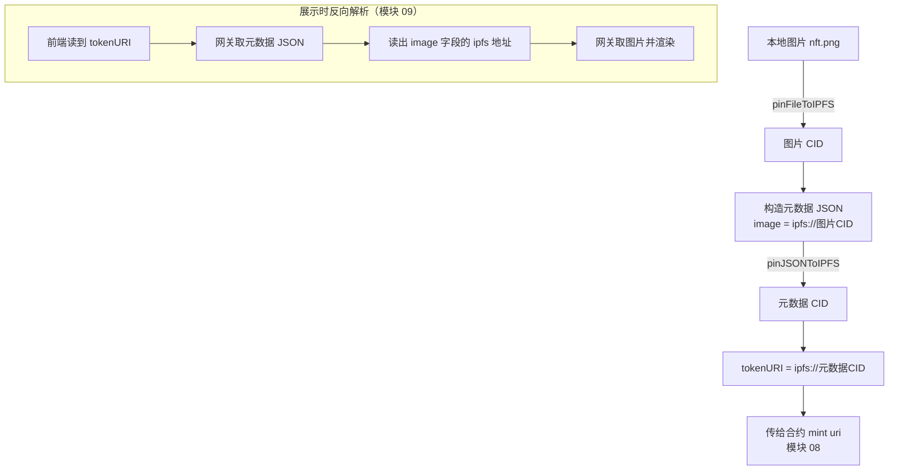

# 05 · 上传图片与元数据到 IPFS（Upload Metadata to IPFS）

> 一句话：把 NFT 的图片和描述它的元数据 JSON 上传到 IPFS，得到一个 `ipfs://<CID>` 地址——这个地址就是要传给合约 `mint()` 的 `tokenURI`。

## 📖 知识讲解

NFT 合约里每枚只存一个短短的 `tokenURI` 指针，真正的图片和元数据存在**链下**。为什么？因为链上存储极贵，一张图存上链要花天价 Gas。所以业界统一做法：**内容放 IPFS，链上只存指针**。

### IPFS 与 CID

**IPFS**（星际文件系统）是去中心化存储网络，核心特性是**内容寻址**：文件的地址（CID，Content Identifier）由内容本身的哈希算出。含义是——**内容不变，地址就不变；内容改一个字节，地址就完全变**。这天然防篡改，也正契合 NFT「不可变」的精神。

### 为什么还需要 Pinata（Pinning）

IPFS 节点默认只缓存自己用到的文件，不会永久替你保存。要让文件长期在线可访问，需要**固定（Pin）服务**帮你持续托管。**Pinata** 是最常用的一家，免费额度足够学习。上传后它返回 CID，并提供一个 https 网关方便浏览器直接预览。

### NFT 元数据标准（OpenSea / EIP-721 Metadata）

元数据是一份 JSON，钱包和市场按约定字段解析：

```json
{
  "name": "NFT 名称",
  "description": "描述",
  "image": "ipfs://<图片CID>",
  "attributes": [ { "trait_type": "Level", "value": "Beginner" } ]
}
```

注意 `image` 要用 `ipfs://` 去中心化地址，而不是某个网关的临时 https 地址。

### 两步上传（顺序不能反）

先传图片拿到 `imageCID`，再把它填进元数据 JSON 里一起传，最后拿到 `metadataCID`。合约要的是后者：`ipfs://<metadataCID>`。

## 🔄 上传与寻址流程图



## 💻 代码说明

见 `uploadToPinata.js`（Node 18+，用内置 `fetch` / `FormData` / `Blob`，无需第三方 SDK）：

- `uploadFile()` → 调 Pinata `pinFileToIPFS` 上传图片，返回 CID。
- `uploadJSON()` → 调 `pinJSONToIPFS` 上传元数据，返回 CID。
- `main()` 串起两步，最后打印可直接用于铸造的 `ipfs://<metadataCID>`。

`metadata-example.json` 是一份元数据样例。凭据 `PINATA_JWT` 从 `.env` 读取（已 gitignore）。

## ▶️ 运行方式

```bash
cd 05-upload-metadata-ipfs
npm install                       # 只装 dotenv
cp .env.example .env              # 填入你的 Pinata JWT
# 准备一张图片放当前目录，例如 nft.png
node uploadToPinata.js ./nft.png
```

终端会打印图片 CID、元数据 CID，以及最终的 `ipfs://<metadataCID>`。也可以完全用 Pinata 网页版手动上传（无需写代码），效果一样。

> 提示：Pinata JWT 从 https://app.pinata.cloud/developers/api-keys 创建。

## ⚠️ 常见坑 / 安全提示

- **`image` 别用网关 https 地址**：网关可能关停，务必写 `ipfs://<CID>`（去中心化、永久有效）。
- **JWT 是敏感凭据**：等于账户密码，放 `.env`、勿提交、勿外发。
- **用 FormData 上传时不要手动设 `Content-Type`**：让运行时自动带上 boundary，否则上传失败。
- **网关加载慢**：公共网关偶尔慢或限流，属正常；生产可用专属网关。
- IPFS 上的东西是**公开**的，别传隐私内容。

## 🔗 官方文档

- IPFS 文档：https://docs.ipfs.tech/
- 什么是 CID：https://docs.ipfs.tech/concepts/content-addressing/
- Pinata 文档：https://docs.pinata.cloud/
- OpenSea 元数据标准：https://docs.opensea.io/docs/metadata-standards
