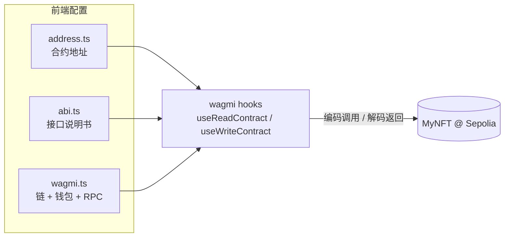

# 06 · 前端脚手架与合约接入（Frontend Setup）

> 一句话：用 Vite + React 起一个前端工程，装好 wagmi v2 / RainbowKit / viem，并把「合约地址 + ABI + 链配置」准备好——为后面连钱包、铸造、展示打地基。

## 📖 知识讲解

模块 06~09 共同构成**一个** React 前端应用，本模块负责搭骨架、装依赖、接通合约信息。

### 技术栈

| 库 | 作用 |
| --- | --- |
| **Vite** | 极快的前端构建/开发服务器 |
| **React 18** | UI 框架 |
| **wagmi v2** | 一套 React Hooks，封装「连钱包、读合约、发交易」 |
| **viem** | wagmi 底层的以太坊库（类型安全，替代 ethers 在前端的角色） |
| **RainbowKit** | 开箱即用的漂亮「连接钱包」弹窗 |
| **TanStack Query** | wagmi v2 依赖它做异步缓存（必须一起装） |

### 前端要「认识」合约的三件套

前端本身不含合约逻辑，它靠三样东西和链上合约对话：

1. **合约地址**（`src/contract/address.ts`）——模块 04 部署后拿到的 `0x...`，指明「跟哪个合约说话」。
2. **ABI**（`src/contract/abi.ts`）——接口说明书，让 wagmi 知道每个函数的名字/参数/返回，从而正确编解码。来自编译产物 `artifacts/.../MyNFT.json` 的 `abi` 字段。
3. **链与 RPC 配置**（`src/config/wagmi.ts`）——指定连 Sepolia、支持哪些钱包、走哪个 RPC。

### 目录结构（最终 06~09 合并后的完整前端）

```
frontend/
├── index.html
├── package.json / vite.config.ts / tsconfig.json
└── src/
    ├── main.tsx                     ← 入口（06）
    ├── App.tsx                      ← Provider 包裹 + 连钱包（07）
    ├── config/wagmi.ts              ← 链/钱包配置（06）
    ├── contract/address.ts          ← 合约地址（06）
    ├── contract/abi.ts              ← 合约 ABI（06）
    └── components/
        ├── MintPanel.tsx            ← 铸造（08）
        └── MyNFTs.tsx               ← 我的 NFT（09）
```

## 🔄 前端接入合约的关系图



## 💻 代码说明

- `package.json`：锁定 wagmi v2 / RainbowKit v2 / viem v2 / react-query v5 版本组合。
- `src/config/wagmi.ts`：用 RainbowKit 的 `getDefaultConfig` 一把梭配置，`chains: [sepolia]`，需要一个 WalletConnect `projectId`（从 https://cloud.reown.com 免费申请）。
- `src/contract/abi.ts`：用 `as const` 声明精简版 ABI，wagmi 借此在编译期推断类型。
- `src/contract/address.ts`：**部署后把 `CONTRACT_ADDRESS` 换成你自己的地址**。
- `src/main.tsx`：入口，挂载 `<App/>`（App 在模块 07）。

## ▶️ 运行方式

```bash
cd 06-frontend-setup     # 后续把 07/08/09 的 src 文件合并进来
npm install
npm run dev              # 打开 http://localhost:5173
```

此刻页面还很简单（App/组件在 07~09 完善）。**开发前先做两件事**：

1. 把 `src/contract/address.ts` 的 `CONTRACT_ADDRESS` 改成模块 04 部署得到的地址。
2. 把 `src/config/wagmi.ts` 的 `projectId` 换成你的 WalletConnect Project ID。

## ⚠️ 常见坑 / 安全提示

- **版本要配套**：wagmi v2 必须搭 viem v2 + @tanstack/react-query v5，混用旧版会报错。
- **忘了改合约地址**：默认是全零地址，读写都会失败。
- **ABI 与合约不一致**：改了合约要重新编译并同步 ABI，否则调用对不上。
- 前端里出现的 `projectId` 只是公开标识，不是密钥；但**真正的私钥永远只在用户钱包里**，前端拿不到也不该拿。

## 🔗 官方文档

- wagmi 安装与配置：https://wagmi.sh/react/getting-started
- RainbowKit 安装：https://www.rainbowkit.com/docs/installation
- viem 文档：https://viem.sh/
- Vite 文档：https://vitejs.dev/
