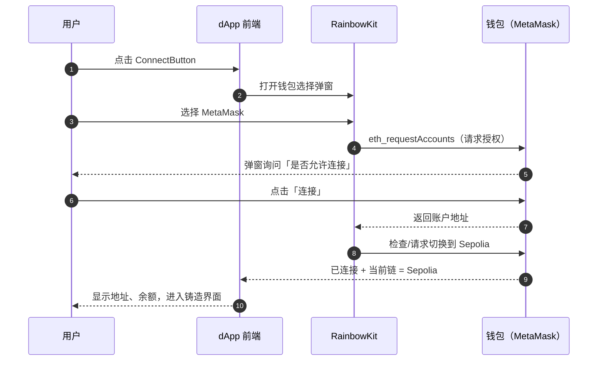

# 07 · 连接钱包（Connect Wallet with RainbowKit）

> 一句话：用 RainbowKit 提供的一体化「连接钱包」按钮，让用户一键连上 MetaMask 等钱包并切换到 Sepolia——这是一切链上交互的前提。

## 📖 知识讲解

dApp 不像传统网站用账号密码登录，而是**用钱包连接**：用户用自己的钱包（如 MetaMask）授权网页读取地址、请求签名。底层遵循 **EIP-1193**（钱包与网页通信的标准接口）。RainbowKit 把这套握手 + 弹窗 UI + 多钱包适配全封装好了，我们只用两样东西：

- `<RainbowKitProvider>`：包在应用外层，提供弹窗环境。
- `<ConnectButton />`：一个组件搞定「连接/显示地址/显示余额/切换网络」。

### 三层 Provider（顺序不能错）

```
WagmiProvider            ← 最外：链/钱包/合约状态的地基
  └─ QueryClientProvider ← 中间：wagmi v2 用 TanStack Query 管异步缓存
       └─ RainbowKitProvider ← 最内：连接钱包的 UI
            └─ 你的页面
```

顺序错了（比如把 RainbowKit 放最外）会导致 hook 找不到 context 而报错。

### 连接后用什么读状态

- `useAccount()` → `address`（当前地址）、`isConnected`（是否已连）、`chainId`（当前链）。
- 本模块用 `isConnected` 决定：没连就提示先连钱包，连了才显示铸造和列表。

## 🔄 钱包连接握手时序图（EIP-1193）



## 💻 代码说明

见 `src/App.tsx`：

- 顶部 `import '@rainbow-me/rainbowkit/styles.css'`——**必须引入**，否则弹窗没样式。
- `App` 组件用三层 Provider 把 `<Main/>` 包起来，`config` 来自模块 06 的 `wagmi.ts`。
- `Main` 里放 `<ConnectButton />`（RainbowKit 一体化按钮），并用 `useAccount()` 的 `isConnected` 分支渲染：已连显示 `<MintPanel/>`（模块 08）+ `<MyNFTs/>`（模块 09），未连显示提示。

## ▶️ 运行方式

把本模块的 `src/App.tsx` 放进模块 06 的前端工程 `src/` 下，然后：

```bash
npm run dev            # http://localhost:5173
```

页面右上角出现「Connect Wallet」按钮，点击 → 选 MetaMask → 授权 → 切到 Sepolia，即完成连接。

> 前提：浏览器已装 MetaMask，且钱包里添加/切换到了 Sepolia 网络（RainbowKit 通常会引导切换）。

## ⚠️ 常见坑 / 安全提示

- **Provider 顺序/缺失**：漏了任一层或顺序反了都会报「找不到 context」。
- **忘引入 RainbowKit 样式**：弹窗会错乱。
- **连错网络**：本 dApp 只支持 Sepolia，用户在别的链会读写失败，`ConnectButton` 会提示切换。
- **签名钓鱼警惕**：连接本身只暴露地址（安全）；但任何要求**签名/授权**的操作都要看清内容，别在陌生站点乱签（钓鱼签名可盗资产）。
- **连接 ≠ 登录后端**：地址是公开的，真正的身份证明需要「签名验证」（SIWE），本教学项目未涉及。

## 🔗 官方文档

- RainbowKit ConnectButton：https://www.rainbowkit.com/docs/connect-button
- wagmi useAccount：https://wagmi.sh/react/api/hooks/useAccount
- EIP-1193（Provider 标准）：https://eips.ethereum.org/EIPS/eip-1193
