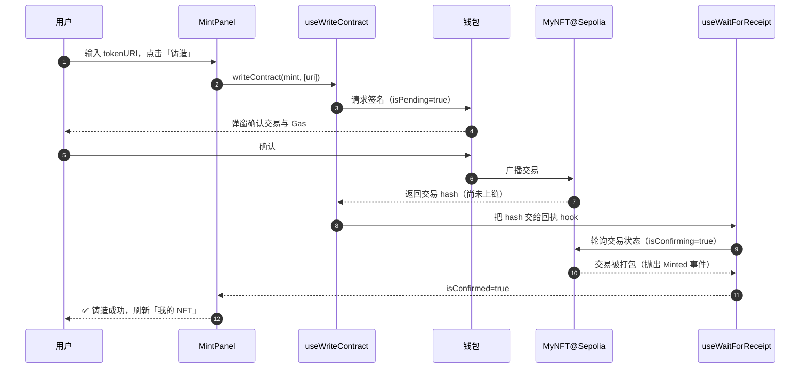

# 08 · 铸造流程（Mint Flow）

> 一句话：点击「铸造」→ 弹钱包签名 → 交易发送 → 等待区块确认 → 反馈成功，用 wagmi 的 `useWriteContract` + `useWaitForTransactionReceipt` 覆盖交易的完整生命周期。

## 📖 知识讲解

铸造是一次**写交易**（改变链上状态、要花 Gas），和「读」完全不同。一次写交易有三个阶段，前端要分别给用户反馈，否则用户会以为卡死：

| 阶段 | 发生了什么 | 对应状态 |
| --- | --- | --- |
| **① 提交** | 弹钱包，用户签名并广播 | `isPending`（写 hook） |
| **② 确认中** | 交易进了内存池，等矿工/验证者打包 | `isConfirming`（回执 hook） |
| **③ 已确认** | 交易被区块收录，铸造真正生效 | `isConfirmed`（回执 hook） |

### 两个 wagmi hook 配合

- `useWriteContract()` → 返回 `writeContract`（触发交易）、`data`（交易 hash）、`isPending`、`error`。**拿到 hash 不代表成功，只代表已发出。**
- `useWaitForTransactionReceipt({ hash })` → 把上一步的 hash 传进来，监听它是否被确认，返回 `isLoading`（确认中）、`isSuccess`（已确认）。

真正的「成功」以 ③ `isConfirmed` 为准。

### 调用合约的写法

```ts
writeContract({
  address: CONTRACT_ADDRESS,
  abi: MyNFTAbi,
  functionName: 'mint',
  args: [uri],           // 对应 Solidity mint(string uri)，uri 来自模块 05
})
```

## 🔄 铸造交易时序图



## 💻 代码说明

见 `src/components/MintPanel.tsx`：

- 受控输入框收集 `tokenURI`（模块 05 得到的 `ipfs://...`）。
- `useReadContract` 读 `totalMinted` 显示「已铸造 X / 1000」。
- `useWriteContract` 发起 `mint`，按钮文案随 `isPending`/`isConfirming` 变化（「请在钱包中确认…」「上链确认中…」）。
- `useWaitForTransactionReceipt` 监听确认，成功后提示并 `refetch` 进度。
- 全程展示交易 hash 并链接到 Sepolia Etherscan；`error` 分支友好提示（如用户拒绝签名）。

## ▶️ 运行方式

把 `src/components/MintPanel.tsx` 放进前端工程（模块 07 的 `App.tsx` 已 import 它），确保 `address.ts` 已填真实合约地址，然后：

```bash
npm run dev
```

连钱包（Sepolia，且有测试 ETH）→ 填入 `ipfs://<你的元数据CID>` → 点「铸造」→ 钱包确认 → 等几秒变绿「铸造成功」。

## ⚠️ 常见坑 / 安全提示

- **别在 `isPending=true` 时以为成功**：那只是「已发出」，要等 `isConfirmed`。
- **没有测试 ETH**：交易发不出（付不起 Gas），先领水龙头。
- **`args` 类型要对**：`mint(string)` 就传字符串；数量类参数要用 BigInt。
- **用户拒签/Gas 不足**：会进 `error` 分支，务必给出可读提示，别让界面静默。
- **看清签名内容**：正经 dApp 的铸造交易会显示调用的合约与函数；对要求「无限授权」或看不懂的签名保持警惕。

## 🔗 官方文档

- wagmi useWriteContract：https://wagmi.sh/react/api/hooks/useWriteContract
- wagmi useWaitForTransactionReceipt：https://wagmi.sh/react/api/hooks/useWaitForTransactionReceipt
- wagmi 写合约指南：https://wagmi.sh/react/guides/write-to-contract
