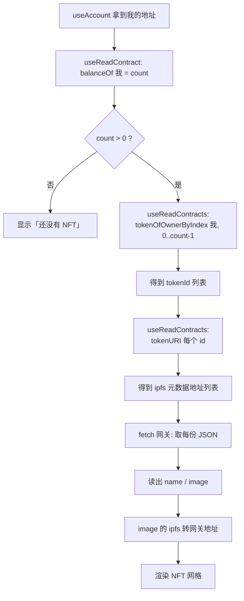

# 09 · 展示我拥有的 NFT（Display My NFTs）

> 一句话：读取当前钱包持有的所有 NFT 的 tokenId 与元数据，把图片和名称渲染成一个网格——全程只是链上「读」，不花 Gas。

## 📖 知识讲解

「我有哪些 NFT」这个看似简单的问题，链上其实要分几步查，因为 ERC721 本身不提供「列出某人全部 NFT」的方法——这正是我们在合约里加 **`ERC721Enumerable`** 扩展的原因。

### 四步读取

```
1. balanceOf(我)                  → 我持有几枚 count
2. tokenOfOwnerByIndex(我, i)     → 第 i 枚的 tokenId（i 从 0 到 count-1）
3. tokenURI(tokenId)             → 每枚的元数据地址 ipfs://...
4. fetch(元数据 JSON)             → 读出 name / image，渲染
```

第 2、3 步是「同一函数、不同参数」的批量读，用 wagmi 的 **`useReadContracts`（复数）** 一次并发请求，比逐个 `useReadContract` 高效得多。

### ipfs:// 要转成网关地址才能 fetch

浏览器不认 `ipfs://`，需转成 https 网关地址再取：

```ts
'ipfs://CID/0.json' → 'https://gateway.pinata.cloud/ipfs/CID/0.json'
```

元数据里的 `image` 字段同样是 `ipfs://`，渲染 `` 前也要转换。

### 读 vs 写

本模块全是**读**（`view` 函数）：不改状态、不花 Gas、不弹钱包。这是 dApp 里最常见的操作——绝大多数界面都是「读链 + 展示」。

## 🔄 读取与渲染流程图



## 💻 代码说明

见 `src/components/MyNFTs.tsx`：

- `useAccount()` 取地址；`useReadContract` 读 `balanceOf`（`query.enabled` 控制没连钱包就不请求）。
- 第一个 `useReadContracts` 批量读 `tokenOfOwnerByIndex` → 得到 `tokenIds`。
- 第二个 `useReadContracts` 批量读 `tokenURI` → 得到元数据地址。
- `useEffect` 里对每个地址 `fetch`（经 `ipfsToHttp` 转网关）拿 JSON，存进 `metas` 状态。
- 渲染成响应式网格，展示 `image` 与 `name`；加载失败有兜底文案。

## ▶️ 运行方式

把 `src/components/MyNFTs.tsx` 放进前端工程（模块 07 的 `App.tsx` 已 import 它）：

```bash
npm run dev
```

连上钱包后，先在上方（模块 08）铸造一枚，稍等确认，下方「我的 NFT」就会出现它的图片。也可以直接换用一个已经铸过 NFT 的地址查看。

## ⚠️ 常见坑 / 安全提示

- **依赖 Enumerable 扩展**：合约必须继承 `ERC721Enumerable`，否则没有 `tokenOfOwnerByIndex`，这条路走不通（否则要靠索引器或扫 Transfer 事件）。
- **BigInt 与 Number 转换**：`balanceOf` 返回 BigInt，做数组长度要 `Number(...)`；`args` 里的 index 要 `BigInt(i)`。
- **网关加载慢/失败**：公共网关偶尔不稳，代码里有加载失败兜底；生产可换专属网关或多网关重试。
- **数据量大时**：`Enumerable` 逐枚查在数量很大时较慢，生产项目常改用 The Graph 等链上索引器。
- 这些都是**公开只读**数据，无隐私风险；但展示的图片来自 IPFS，注意别渲染不可信来源的恶意内容。

## 🔗 官方文档

- wagmi useReadContract：https://wagmi.sh/react/api/hooks/useReadContract
- wagmi useReadContracts（批量）：https://wagmi.sh/react/api/hooks/useReadContracts
- OpenZeppelin ERC721Enumerable：https://docs.openzeppelin.com/contracts/5.x/api/token/erc721#ERC721Enumerable
