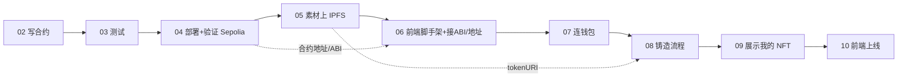

# 10 · 部署前端与项目总结（Wrap-up & Deploy）

> 一句话：把前端也部署上线，回顾整条 dApp 全链路，并给出可继续深挖的扩展方向。

## 📖 知识讲解

到这里，你已经独立完成了一个**端到端的 NFT 铸造 dApp**：写合约 → 测试 → 部署验证 → 素材上 IPFS → 前端连钱包 → 铸造 → 展示。这一节把前端也发布出去，让别人能用你的 dApp。

### 部署前端（纯静态站点）

前端是 Vite 打的**纯静态站点**（HTML/JS/CSS），任何静态托管都能放。合约地址和 ABI 已编进包里，前端只在浏览器里连用户钱包和公共 RPC，不需要自己的服务器。

```bash
cd frontend
npm run build       # 产出 dist/ 静态文件
npm run preview     # 本地预览生产包
```

常见免费托管：**Vercel**、**Netlify**、**Cloudflare Pages**、**GitHub Pages**。以 Vercel 为例：把前端目录推到 GitHub → 在 Vercel 导入仓库 → 框架选 Vite → 部署即可拿到公网 https 地址。

> 记得在托管平台配置好前端用到的公开变量（如 WalletConnect projectId），并确保 `address.ts` 指向已部署的 Sepolia 合约。

## 🔄 全链路回顾图



## 💻 代码说明

本模块无新代码，是把前面各模块的 `src` 合并成一个可运行前端并打包发布。合并后的完整结构见模块 06 的目录树。

## ▶️ 运行方式（完整回顾）

1. **合约端**（模块 03 工程）：`npm install` → `npx hardhat test` → 配 `.env` → `npx hardhat run scripts/deploy.js --network sepolia`，记下合约地址。
2. **素材**（模块 05）：`node uploadToPinata.js ./nft.png`，得到 `ipfs://<metadataCID>`。
3. **前端**（模块 06 工程，合并 07/08/09）：改 `address.ts` 合约地址 + `wagmi.ts` projectId → `npm run dev` 本地跑通 → `npm run build` → 部署到 Vercel/Netlify。

## ⚠️ 常见坑 / 安全提示

- **上线前再确认**：合约在 **Sepolia**、`.env` 未进仓库、合约标注教学未审计。
- **前端是静态站**：任何人可查看源码与合约地址，别把任何密钥打进前端包。
- **合约不可变**：部署后逻辑改不了；真要可升级需用代理模式（另一个大话题）。
- **主网需谨慎**：教学合约未经审计，**切勿**改改就上主网收真钱。

## 🚀 可扩展方向

- **铸造收费 / 限量 / 白名单**：给 `mint` 加 `payable` 价格、每地址上限、Merkle 白名单或签名许可（EIP-712）。
- **可升级合约**：OpenZeppelin 的透明代理 / UUPS。
- **懒铸造（Lazy Mint）**：签名授权，买家铸造时才上链，省 Gas。
- **版税**：实现 EIP-2981 让二级市场分成。
- **索引器**：用 The Graph 替代 Enumerable 做大规模查询。
- **登录**：Sign-In with Ethereum（SIWE，EIP-4361）做去中心化身份。
- **多链**：在 `wagmi.ts` 的 `chains` 里加更多测试网。

## 🔗 官方文档

- Vite 构建部署：https://vitejs.dev/guide/static-deploy.html
- Vercel 部署 Vite：https://vercel.com/docs/frameworks/vite
- EIP-2981 版税：https://eips.ethereum.org/EIPS/eip-2981
- Sign-In with Ethereum：https://docs.login.xyz/
- OpenZeppelin 可升级合约：https://docs.openzeppelin.com/upgrades-plugins/
