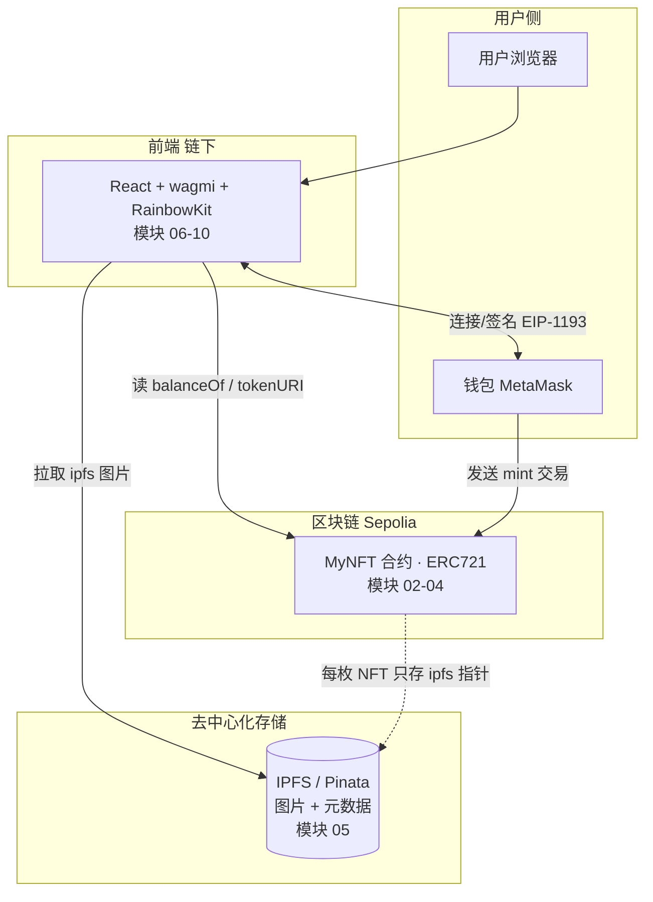
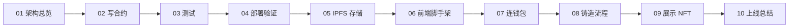

# 12 · 全栈 dApp 综合实战（Full-stack dApp）· NFT 铸造应用

> 本工程是「Web3 学习合集」的**收官贯穿项目**：把前 11 个工程学的合约、OpenZeppelin、Hardhat、ethers/viem、钱包、wagmi/RainbowKit、IPFS 全部串起来，从零做出一个**完整、可上线、端到端**的 NFT 铸造 dApp。

## 📖 项目简介

我们做的这个 dApp 干一件事，但把全链路走通：

**用户打开网页 → 连接钱包（Sepolia）→ 输入一份 IPFS 元数据地址 → 点击「铸造」→ 一枚 NFT 进入他的钱包 → 页面实时展示他拥有的所有 NFT。**

- **链上**：OpenZeppelin ERC721 合约 `MyNFT`（可公开铸造、绑定 IPFS 元数据、可枚举）。
- **存储**：图片与元数据放 IPFS（Pinata 固定），链上只存 `ipfs://` 指针。
- **前端**：Vite + React + wagmi v2 + RainbowKit + viem。
- **网络**：Sepolia 测试网 + 免费水龙头测试币，**全程不碰主网真钱**。

这是一个采用「一条龙」教学法的项目：**每个模块 = 一步真实开发**，含真实代码 + 固定结构 README（含 Mermaid 图 / 中文讲解 / 安全提示 / 官方链接）。

## 🔄 整体架构



学习路线（按编号推进）：



## 🗂️ 模块（步骤）索引

| 步骤 | 模块 | 你会做什么 | 关键产物 |
| --- | --- | --- | --- |
| 01 | [project-architecture](./01-project-architecture/) | 看懂合约/前端/IPFS/测试网如何协作 | 架构图 + 数据流时序图 |
| 02 | [nft-contract](./02-nft-contract/) | 用 OZ v5 ERC721 写可铸造 NFT 合约 | `MyNFT.sol` |
| 03 | [hardhat-test](./03-hardhat-test/) | 用 Hardhat 给合约写单元测试 | 完整 Hardhat 工程 + `MyNFT.test.js` |
| 04 | [deploy-sepolia](./04-deploy-sepolia/) | 部署到 Sepolia 并在 Etherscan 验证 | `deploy.js` + 合约地址 |
| 05 | [upload-metadata-ipfs](./05-upload-metadata-ipfs/) | 图片/元数据上传 IPFS（Pinata） | `uploadToPinata.js` + `tokenURI` |
| 06 | [frontend-setup](./06-frontend-setup/) | Vite+React+wagmi 脚手架，接 ABI/地址 | 前端工程 + `abi.ts`/`address.ts` |
| 07 | [connect-wallet](./07-connect-wallet/) | RainbowKit 一键连钱包 | `App.tsx`（三层 Provider） |
| 08 | [mint-flow](./08-mint-flow/) | 铸造：发交易→等确认→反馈 | `MintPanel.tsx` |
| 09 | [display-my-nfts](./09-display-my-nfts/) | 读取并展示用户拥有的 NFT | `MyNFTs.tsx` |
| 10 | [wrap-up](./10-wrap-up/) | 前端上线、总结、可扩展方向 | 部署指南 |

> 提示：模块 03 与 04 共用**同一个 Hardhat 工程**（04 的 `deploy.js` 放进 03 的 `scripts/`）；模块 06~10 共同构成**同一个前端工程**（07~09 的 `src` 文件合并进 06）。

## ▶️ 完整运行说明

### 0. 准备工作（一次性）

| 需要 | 说明 | 从哪来 |
| --- | --- | --- |
| Node.js | 合约端 18+，如用 Hardhat 3 需 22.13+ | https://nodejs.org |
| MetaMask | **测试专用**钱包，切到 Sepolia | 浏览器扩展 |
| Sepolia 测试 ETH | 付 Gas 用 | 水龙头（见下） |
| Alchemy/Infura Key | Sepolia RPC | https://alchemy.com |
| Etherscan API Key | 合约验证 | https://etherscan.io/myapikey |
| Pinata JWT | 上传 IPFS | https://app.pinata.cloud |
| WalletConnect projectId | 前端连钱包 | https://cloud.reown.com |

**Sepolia 水龙头**（领测试 ETH）：
- https://www.alchemy.com/faucets/ethereum-sepolia
- https://cloud.google.com/application/web3/faucet/ethereum/sepolia
- https://sepoliafaucet.com

### 1. 合约端（模块 02→03→04）

```bash
cd 03-hardhat-test
npm install
npx hardhat compile          # 编译
npx hardhat test             # 跑测试（本地、免费、离线）

# 部署：先把 04 的 deploy.js 放进 scripts/，并配好 .env
cp ../04-deploy-sepolia/.env.example .env   # 填 SEPOLIA_RPC_URL / PRIVATE_KEY / ETHERSCAN_API_KEY
# 确保 .env 的钱包已从水龙头领到测试 ETH
npx hardhat run scripts/deploy.js --network sepolia
# 记下打印出的合约地址 0x....
```

### 2. 素材上 IPFS（模块 05）

```bash
cd ../05-upload-metadata-ipfs
npm install
cp .env.example .env         # 填 PINATA_JWT
node uploadToPinata.js ./nft.png   # 得到 ipfs://<metadataCID>
```

### 3. 前端（模块 06→10）

```bash
cd ../06-frontend-setup
# 把 07/08/09 的 src 文件合并到本工程 src/ 下（见模块 06 的目录树）
npm install
# 改两处：src/contract/address.ts 的合约地址；src/config/wagmi.ts 的 projectId
npm run dev                  # http://localhost:5173
```

浏览器打开 → 连钱包（Sepolia）→ 填 `ipfs://<metadataCID>` → 铸造 → 在「我的 NFT」看到它。

上线：`npm run build` 后把 `dist/` 部署到 Vercel/Netlify（见模块 10）。

## ⚠️ 安全底线（务必遵守）

- **只用 Sepolia 测试网**，绝不使用主网真实资产。
- **私钥 / API Key / Pinata JWT 一律走 `.env`** 并已 `.gitignore`，绝不写进代码或外发；建议用只放少量测试币的小号钱包。
- 涉及**签名/授权**的操作要看清内容，警惕钓鱼签名与无限授权。
- 本项目所有合约**教学用途，未经审计，勿直接上主网**。

## 🔗 官方文档总览

- 以太坊 dApp：https://ethereum.org/zh/developers/docs/dapps/
- OpenZeppelin Contracts v5：https://docs.openzeppelin.com/contracts/5.x/
- Hardhat：https://hardhat.org/docs
- wagmi：https://wagmi.sh/ ｜ RainbowKit：https://www.rainbowkit.com/ ｜ viem：https://viem.sh/
- IPFS：https://docs.ipfs.tech/ ｜ Pinata：https://docs.pinata.cloud/
