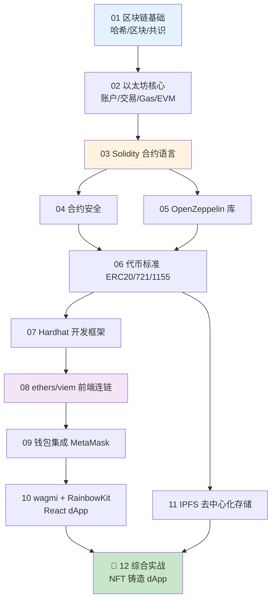

# Web3 学习合集 ⛓️

> 从零系统学习 Web3 / 区块链 / dApp 开发。**每个技术领域一个工程，每个知识点一个独立可运行小 demo**，全程详细中文注释 + Mermaid 流程图 + 模块独立 README。所有内容对照各自**官方权威文档**整理。

风格对齐姊妹项目 [`frontend-learning`](../frontend-learning)。Web3 本质是 **前端 + 智能合约 + 钱包**，前端基础扎实的同学能快速上手。

---

## 一、工程总览

| # | 工程 | 内容 | 权威来源 | 运行方式 |
|---|---|---|---|---|
| 01 | [`01-blockchain-basics`](01-blockchain-basics) | 区块链基础：哈希/区块/默克尔树/共识/签名 | ethereum.org、比特币白皮书 | Node / 浏览器 |
| 02 | [`02-ethereum`](02-ethereum) | 以太坊核心：账户/交易/Gas/EVM/网络 | ethereum.org | Node / 公共 RPC |
| 03 | [`03-solidity`](03-solidity) | 智能合约语言 Solidity | soliditylang.org | Remix 在线免装 |
| 04 | [`04-smart-contract-security`](04-smart-contract-security) | 合约安全：重入/权限/溢出等漏洞与防御 | OpenZeppelin、SWC | Remix |
| 05 | [`05-openzeppelin`](05-openzeppelin) | 标准合约库 OpenZeppelin | openzeppelin.com | Remix |
| 06 | [`06-token-standards`](06-token-standards) | 代币标准 ERC-20 / 721(NFT) / 1155 | ethereum.org、EIPs | Remix |
| 07 | [`07-dev-tools-hardhat`](07-dev-tools-hardhat) | 开发框架 Hardhat / Foundry | hardhat.org | npm / Node |
| 08 | [`08-ethers-viem`](08-ethers-viem) | 前端连接链：ethers.js / viem | docs.ethers.org、viem.sh | 浏览器 / Node |
| 09 | [`09-wallet-integration`](09-wallet-integration) | 钱包集成 MetaMask / EIP-1193 | docs.metamask.io | 浏览器 + 钱包 |
| 10 | [`10-wagmi-rainbowkit`](10-wagmi-rainbowkit) | React dApp：wagmi + RainbowKit | wagmi.sh | Vite / npm |
| 11 | [`11-ipfs-storage`](11-ipfs-storage) | 去中心化存储 IPFS / NFT 元数据 | docs.ipfs.tech | 浏览器 / Node |
| 12 | [`12-dapp-fullstack`](12-dapp-fullstack) | 综合实战：完整 NFT 铸造 dApp | 综合 | Hardhat + Vite |

---

## 二、推荐学习路线



**三阶段建议：**

1. **看懂链**（01→02）：区块链和以太坊到底怎么运转——哈希、区块、账户、交易、Gas、EVM。纯概念 + 小 demo，不碰钱不碰链。
2. **写合约**（03→04→05→06→07）：用 Solidity 写智能合约，懂安全漏洞，用 OpenZeppelin 发币/发 NFT，用 Hardhat 测试部署。**Solidity 全程用 Remix 在线 IDE，免安装**。
3. **做前端 dApp**（08→09→10→11→12）：这部分就是**前端活**——用 ethers/viem/wagmi 让网页连上链、连上钱包，最后做一个完整的 NFT 铸造 dApp。

> 前端同学的捷径：如果你只想快速做 dApp 前端，可先扫一遍 01~03 建立概念，重点砸 08→09→10→12。

---

## 三、⚠️ 安全底线（务必牢记）

- **只用测试网**（Sepolia 等）+ 水龙头领的**测试币**，**绝不碰主网真钱**。
- **绝不把真实私钥 / 助记词 / API Key 写进代码或提交到 git**（本仓库 `.gitignore` 已屏蔽 `.env`）。
- 对任何要你**签名**或**授权（approve）**的操作保持警惕——这是链上钓鱼的主要手段。
- 本仓库所有合约均为**教学用途、未经审计**，切勿直接部署主网管理真实资产。

---

## 四、目录结构

```
web3-learning/
├── README.md            ← 本文件
├── _CONVENTIONS.md      ← 统一规范
├── 01-blockchain-basics/
│   ├── README.md        ← 工程级：模块索引 + 路线图
│   ├── 01-xxx/
│   │   ├── README.md    ← 模块级：讲解 + Mermaid 图 + 运行方式
│   │   └── demo.js / demo.sol / index.html
│   └── ...
└── 02-… ~ 12-…
```

---

> 📌 所有内容均对照官方文档整理，每个模块 README 末尾附官方链接。学 Web3 请始终在测试网、用测试币、护好私钥。
